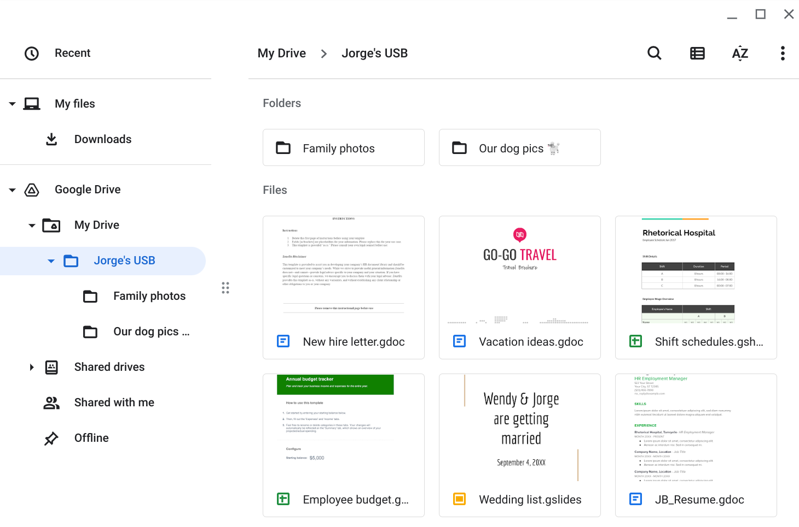

# **USB Baiting Attack Assessment**

In this activity, you will assess the attack vectors of a USB drive. You will consider a scenario of finding a USB drive in a parking lot from both the perspective of an attacker and a target.

USB drives, or flash drives, are commonly used for storing and transporting data. However, their convenience can introduce security risks, as threat actors often use USB drives to deliver malicious software, damage hardware, or take control of systems. USB baiting is an attack method where a malicious USB drive is intentionally left for someone to find, hoping they will plug it into their device, thus infecting it with malware.

## **Scenario**

You are part of the security team at Rhetorical Hospital and arrive to work one morning. On the ground of the parking lot, you find a USB stick with the hospital's logo printed on it. There’s no one else around who might have dropped it, so you decide to pick it up out of curiosity.

You bring the USB drive back to your office where the team has virtualization software installed on a workstation. Virtualization software allows for a safe investigation of the device, as it runs a simulated version of the computer, isolating it from other files or networks.

## **Instructions**

### Step 1: Access the Template

- Use the provided **[exercise template](./Parking-lot-USB-exercise.docx)**for this activity.

### Step 2: Inspect the Contents of the USB Stick

- Create a virtual environment and plug the USB drive into the workstation.
- Review the files on the USB stick, which seem to belong to Jorge Bailey, the human resource manager at Rhetorical Hospital. The USB contains a mix of personal and work-related files, including family and pet photos, a new hire letter, and an employee shift schedule.
- In the **Contents** section of the template, write 2-3 sentences (40-60 words) describing the types of information stored on the USB drive.

### Step 3: Apply an Attacker's Mindset to the Contents of the USB Drive

- Consider how an attacker might exploit the information found on this USB drive. Could this be part of a staged attack?
- In the **Attacker Mindset** section of the template, write 2-3 sentences (40-60 words) on how this information might be used maliciously against Jorge or Rhetorical Hospital.

### Step 4: Analyze the Risks of Finding a Parking Lot USB

- Reflect on the security risks associated with USB baiting attacks.
- Consider potential malicious software that could be hidden on USB devices, and the risks if this drive were infected.
- In the **Risk Analysis** section of the template, write 3-4 sentences (60-80 words) analyzing the technical, operational, or managerial controls that could help mitigate USB baiting attacks.

## **What to Include in Your Response**

- 2-3 sentences about the types of information stored on the USB drive.
- 2-3 sentences about how the information could be used against the owner and/or organization.
- 3-4 sentences analyzing the risks of USB baiting attacks.
