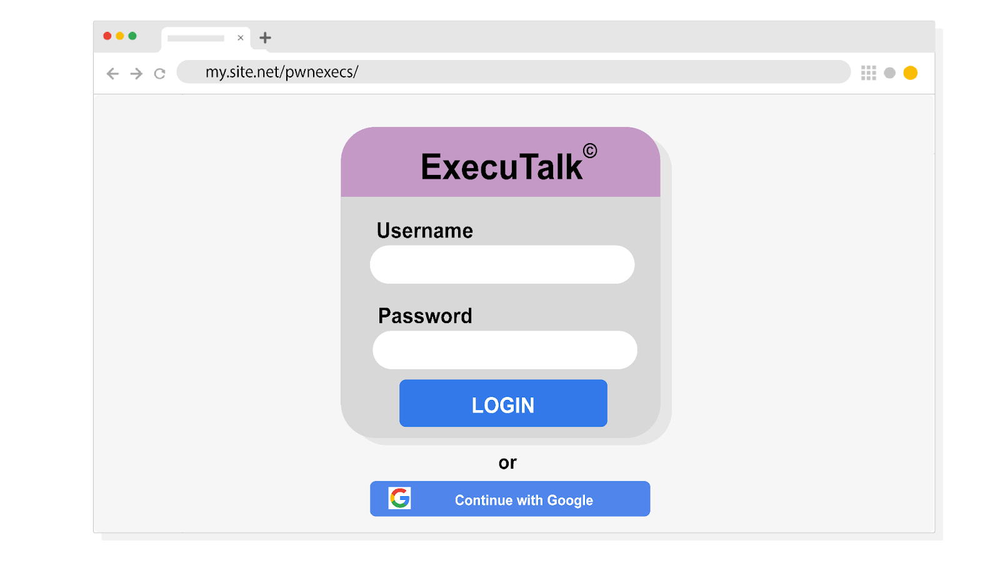

# **Phishing Email Investigation Activity**

In this activity, you will analyze a suspicious email and identify signs of a phishing attack. Then, you will determine whether the email should be allowed or quarantined. Phishing is one of the most common and dangerous forms of social engineering. Identifying phishing attempts will help you prevent threats and improve security procedures.

## **Scenario**

You’re a security analyst at an investment firm called Imaginary Bank. An executive at the firm recently received a spear phishing email that appears to come from the board of Imaginary Bank. Spear phishing is a malicious email attack targeting a specific user or group of users, appearing to originate from a trusted source. In this case, the executive is being asked to install new collaboration software, ExecuTalk.

The executive suspects this email might be a phishing attempt because ExecuTalk was never mentioned during the last board meeting. They've forwarded the message to your team to verify if it’s legitimate. Your supervisor has tasked you with investigating the message and determining whether it should be quarantined.

## **Instructions**

### Step 1: Analyze the suspicious email

- Start your investigation by analyzing the suspicious message. Try to identify clues that this is a phishing attack against the executive at Imaginary Bank:
  - From: <imaginarybank@gmail.org>
  - Sent: Saturday, December 21, 2019  15:05:05
  - To: <cfo@imaginarybank.com>
  - Subject: RE: You are been added to an ecsecutiv's groups
  - Message body: "Conglaturations! You have been added to a collaboration group ‘Execs.’ Download ExecuTalk to your computer. Mac® | Windows® | Android™. You're team needs you! This invitation will expire in 48 hours so act quickly."

### Step 2: Examine the sender's information

- Examine the email header and check the domain name that comes after the @ symbol. Be cautious of personal accounts like @gmail.com, @icloud, @yahoo.com, etc. These are not typical domains used by legitimate businesses for requests involving sensitive information or file downloads.
  - From: <imaginarybank@gmail.org>
  - Sent: Saturday, December 21, 2019  15:05:05
  - To: <cfo@imaginarybank.com>
  - Subject: RE: You are been added to an ecsecutiv's groups

1. Which two clues in the message header indicate to you that this is a phishing attempt? *Note: `imaginarybank` is a made up 'legitimate' bank name in this scenario*

### Step 3: Review the message body for cues

- Review the body of the message and try to identify three ways this threat actor disguised their message as legitimate:
  - "Conglaturations!" (spelling mistake)
  - Requesting immediate action with a sense of urgency ("This invitation will expire in 48 hours.")
  - Offering a link to download ExecuTalk with vague device options ("Mac® | Windows® | Android™").

1. What details make this message appear legitimate? (can you find 3?)

### Step 4: Investigate the download options

- Phishing emails often contain links that redirect to malicious sites or trigger malware downloads. When investigating suspicious emails, always hover your mouse cursor over buttons to reveal the URL without clicking them.
- In this case, the email contains three download options that redirect to a login screen on the domain my.site.net/pwnexecs/. This login page mimics the official ExecuTalk login screen:

1. Carefully review the webpage. What is the main clue that indicates this form is malicious?
2. After completing your investigation, should this email be quarantined?

## **What to Include in your response**

- Analysis of the suspicious email’s sender information and domain.
- Identification of clues in the message body that suggest phishing.
- Explanation of how the download links lead to a malicious website.
