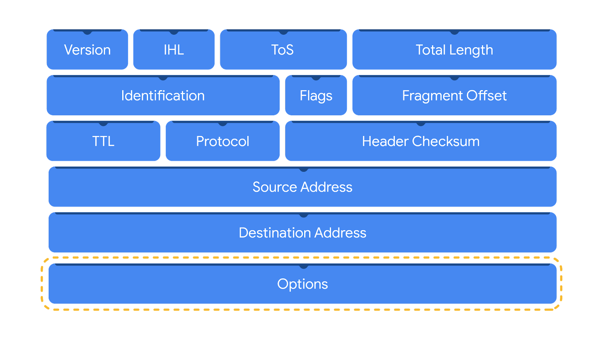

# **Network Monitoring and Analysis**

This module focuses on network analysis using packet sniffing tools such as `tcpdump` and `Wireshark`. Learners will explore how to monitor network traffic, capture packets, and analyze them for signs of malicious activity. The module builds on earlier networking concepts by introducing techniques for interpreting network communications and crafting effective filters to isolate relevant data.

## **Learning Objectives**

- Describe how network traffic analysis helps detect, prevent, and respond to security incidents.
- Use packet sniffing tools to capture and view network communications.
- Analyze packets to interpret network communications.

---

## **Understand Network Traffic**

### Defining Network Traffic

- **Network Traffic** is the volume of data moving across a network.
- It includes both the amount and the type of data transmitted (e.g., HTTP communications).
- In large organizations, traffic can be immense, making it challenging to discern normal from abnormal flows.

### Establishing Baselines and Monitoring

- A **baseline** is a reference point that defines normal network behavior.
- By understanding expected traffic patterns (e.g., peak and off-peak periods), security analysts can quickly spot deviations.
- Monitoring involves continuous observation of network components such as IP addresses, protocols, and data volumes.

### Detecting Indicators of Compromise (IoC)

- **Indicators of Compromise (IoC)** are anomalies that suggest malicious activity, like:
  - Unusual spikes in outbound traffic.
    - i.e. Data exfiltration attempts (large, unexpected data transfers).
  - Deviations from normal traffic patterns, similar to unexpected road traffic during off-peak hours.
    - a worm spreading across the network
    - a DDoS attack undergoing
    - bot to command server communications (botnet)
- Detecting these anomalies is key to triggering further investigation and incident response.

---

## **Capture and View Network Traffic**

This section covers the process of capturing and analyzing network traffic, which is vital for identifying malicious activity or potential intrusions within a network. Understanding how to capture and view network traffic flows helps security analysts track and defend against cybersecurity threats.

### Understanding Network Packets

- **Packets** are the fundamental units of data transmission over networks. Every network activity (like sending an email or uploading an image) involves sending and receiving packets.
- **Packet Components**:
  - **Header**: Contains routing and delivery information such as source and destination IP addresses and packet type.
  - **Payload**: The actual data being transmitted (e.g., an image file).
  - **Footer**: Marks the end of the packet, often used for error checking in protocols like Ethernet.

#### IPV4 Header Fields Overview

IPv4 is the most commonly used version of IP. There are thirteen fields in the header:

- **Version**: Indicates the IP version (IPv4 or IPv6).
- **Internet Header Length (IHL)**: Specifies the length of the header.
- **Type of Service (ToS)**: Describes the treatment for the packet.
- **Total Length**: Indicates the size of the packet.
- **Identification, Flags, and Fragment Offset**: Handle packet fragmentation and reassembly.
- **Time To Live (TTL)**: Prevents packets from looping endlessly by limiting their lifespan.
- **Protocol**: Specifies the protocol used in the packet (e.g., TCP, UDP).
- **Header Checksum**: Used to verify the integrity of the header.
- **Source and Destination IP**: The sender and recipient's IP addresses.
- **Options**: Optional field used for network troubleshooting.



#### IPv6 Header Fields Overview

IPv6 adoption has been increasing because of its large address space. There are eight fields in the header:

- **Version**: Indicates the IP version. For an IPv6 header, this value is set to 6.
- **Traffic Class**: Similar to the IPv4 Type of Service field, it provides information about the packet's priority or class to assist with packet delivery.
- **Flow Label**: Identifies packets belonging to the same flow, which is a sequence of packets sent from a specific source.
- **Payload Length**: Specifies the length of the data portion of the packet.
- **Next Header**: Indicates the type of header that follows the IPv6 header, such as TCP or UDP.
- **Hop Limit**: Similar to the IPv4 Time to Live field, it limits how long a packet can travel in a network before being discarded.
- **Source Address**: Specifies the sender's IP address.
- **Destination Address**: Specifies the receiver's IP address.


### Network Protocol Analyzers

- A **network protocol analyzer** (or packet sniffer) is a tool that captures network traffic and helps inspect packets. Examples include Wireshark, tcpdump, and TShark.
- These tools help monitor for suspicious activity by providing detailed packet information that can be used to track intrusions.

#### How Packet Analyzers Work

- To capture all packets on a network, a **Network Interface Card (NIC)** must be switched to a special mode (monitor or promiscuous mode) that allows the capture of all visible network data.
- The packet analyzer captures raw binary data, which is then converted into a human-readable format for analysis.

### Capturing Network Traffic

- A **packet capture** (P-cap) is a file containing data packets intercepted from a network.
- Packet sniffing allows the collection of these data packets, which can then be analyzed for irregularities or signs of malicious activity.

#### Tools and Libraries for Packet Capture

- **Libpcap**: A Unix-based packet capture library used by tools like tcpdump.
- **Npcap**: A newer packet capture library, used by Windows systems and tools like Nmap.
- **PCAPng**: A next-generation packet capture file format that can store both packet data and additional information.

#### Capturing and Analyzing Packets

- **Packet Sniffing**: This is the process of capturing network packets for later analysis. Using packet analyzers, analysts can filter packets to identify specific types of communication, such as data exfiltration events.
- **Filtering Captures**: Tools like Wireshark or tcpdump allow analysts to filter captures by various parameters, such as IP address or protocol, making it easier to identify relevant data.

#### Packet Capture File Formats

- **Libpcap**: Default for Unix-like systems.
- **WinPcap**: Older format for Windows systems.
- **Npcap**: A more modern version for Windows.
- **PCAPng**: The next-generation format that allows for more flexible packet capture.

---

## **Wireshark: Packet Analysis Tool**

- **Wireshark**: A tool to visualize and analyze network packets using a GUI.
- **Display Filters**: Allows filtering packets to focus on relevant information. Filters can be based on protocols, IP addresses, ports, and other properties.
  - **Comparison Operators**: Use symbols (e.g., `==`, `!=`, `>`, `<`) or abbreviations (e.g., `eq`, `ne`) to create filters.
  - **Boolean Operators**: Combine filters using `and`, `or`, and parentheses for complex queries.
  - **Contains and Matches Operators**: Find packets with specific text or use regular expressions for pattern matching.

### Filter Examples

- **Filter by Protocol**: `dns`, `http`, `ftp`, `ssh`, etc.
- **Filter by IP Address**:
  - `ip.addr == 172.21.224.2`
  - `ip.src == 10.10.10.10`
  - `ip.dst == 4.4.4.4`
- **Filter by MAC Address**: `eth.addr == 00:70:f4:23:18:c4`
- **Filter by Port**:
  - `udp.port == 53`
  - `tcp.port == 25`
- **Follow Streams**: Reconstruct and view entire communication streams between devices using a specific protocol (e.g., HTTP).

### Practical Application: Wireshark in Action

- **Filter Toolbar**: Use the toolbar to quickly filter for protocols or specific packet details.
- **Protocol Stream Viewing**: Following a stream helps visualize full conversations between devices, making it easier to analyze the context of a communication.

---

Here’s the cleaned-up **Markdown notes** for **Section 3: Packet Inspection**, following your style and structure:

---

## **Packet Captures with `tcpdump`**

- `tcpdump` is a **command-line network analyzer** (`packet sniffer`) pre-installed on many Linux distros (also available for macOS and other Unix-like OS).
- It captures and monitors various types of network traffic (e.g., TCP, IP, ICMP).
- **Command-line only** (no GUI), but powerful and flexible with options and filters.
- Useful for:
  - Troubleshooting network issues
  - Identifying suspicious/malicious activity
- Can save captures to a `.pcap` file for later analysis.


### Syntax Overview

```bash
sudo tcpdump [-i interface] [options] [expressions]
```

- `-i interface`: Choose the network interface (e.g., `any`, `eth0`).
- Use `-D` to list all available interfaces.
- Options = modify behavior/output
- Expressions = filter traffic by conditions (IP, port, etc.)

#### Key Options

| Option     | Description |
|------------|-------------|
| `-i`       | Select interface to sniff |
| `-w file`  | Write output to `.pcap` file |
| `-r file`  | Read from `.pcap` file |
| `-v`, `-vv`, `-vvv` | Verbose output levels |
| `-c N`     | Capture only N packets |
| `-n`       | Disable hostname resolution |
| `-nn`      | Disable hostname + port resolution |

#### Example Command Breakdown

```bash
sudo tcpdump -i any -v -c 1
```

- `sudo`: Elevated privileges are required.
- `-i any`: Listen on any network interface.
- `-v`: Verbose mode; gives more detailed packet info.
- `-c 1`: Capture only 1 packet.

### Packet Output Fields

- **Timestamp**: Precise timing down to fractions of a second.
- **IP**: Indicates IPv4 (if seen in output).
- **ToS**: Type of Service (QoS hint) in hex.
- **TTL**: Time to Live; limits packet lifespan.
- **Identification / Offset / Flags**: Used for fragmentation.
  - `DF` = Don't Fragment.
- **Protocol**: e.g., `tcp` is protocol 6.
- **Length**: Total size of the packet.
- **IP addresses and Ports**: With direction arrows (`>`).
- **cksum**: Header checksum status.
- **TCP Flags**: e.g., `P` (push), `.` (ACK).

*Note* Encrypted traffic may require **private keys** to inspect.

#### Interpreting Output

Each captured packet is printed as a single line:

```plaintext
timestamp src_ip.src_port > dst_ip.dst_port: flags ...
```

| Field             | Meaning |
|------------------|---------|
| Timestamp         | When the packet was captured |
| Source IP/Port    | Origin of the packet |
| Destination IP/Port | Target of the packet |
| Flags             | TCP state (e.g., SYN, ACK, PSH) |
| Sequence, Options | Additional TCP/IP info (from `-v`) |


#### Filter Expressions

- **Filter by protocol**: `ip6` (IPv6), `icmp`, `tcp`, etc.
- **Filter by port/IP**:

```bash
sudo tcpdump -r capture.pcap -n 'ip and port 80'
```

- Use **boolean logic**: `and`, `or`, `not`
- Use **quotes and parentheses** for clarity:

```bash
ip and (port 80 or port 443)
```

---

## **Key Takeaways**

- A solid understanding of network traffic is essential for detecting security incidents.
- Establishing and monitoring baselines allows for effective identification of abnormal network behavior.
- Recognizing indicators of compromise in traffic is crucial for timely incident detection and response.
- Mastering Packet analyzer capabilities is essential for isolating and analyzing specific network events.
- This skill will be crucial in cybersecurity investigations, helping identify suspicious activities or vulnerabilities at the packet level.
- `tcpdump` is an essential tool for inspecting network traffic via CLI.
  - Use it to:
    - Capture live traffic
    - Filter traffic using protocols, IPs, ports, and logic
    - Save or read `.pcap` files
- Understanding the packet structure and options is key to effective analysis.
