# Introduction

AI security controls are the measures and protocols implemented to protect artificial intelligence systems from threats, vulnerabilities, and unauthorized access. While traditional security controls (such as network security, access management, and encryption) still apply, AI systems require additional, specialized controls that address the unique risks introduced by natural language interfaces, model behavior, and agent capabilities.

This module provides an overview of the security controls you can implement in AI systems to strengthen the security posture of AI environments. You explore controls across several areas: supply chain security for AI libraries, content filtering, data security, system prompt design, grounding, application security best practices, and ongoing monitoring.

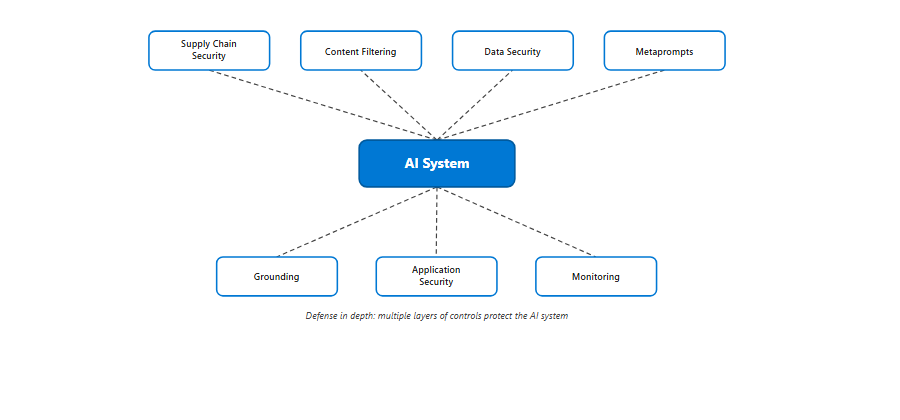

## Learning objectives

By the end of this module, you're able to:

Evaluate open-source AI libraries for security risks
Describe content filtering capabilities and how to configure them effectively
Explain AI data security principles, including agent identity and access control
Design effective metaprompts (system prompts) as a security control
Describe how grounding reduces inaccurate AI-generated content and security risks
Apply application security best practices to AI-enabled applications
Describe monitoring strategies for detecting AI-specific threats

Prerequisites
Familiarity with basic security concepts (for example, authentication, access control, encryption)
Familiarity with basic artificial intelligence concepts (for example, models, training, inference)
Completion of the Fundamentals of AI security module or equivalent knowledge

## Review AI open-source libraries

Open-source software (OSS) is an integral part of modern software development, and AI systems are no exception. AI projects typically depend on open-source frameworks, model libraries, pretrained models, and data processing tools. Just like other OSS components, AI-specific libraries introduce supply chain risks that require a comprehensive security review before adoption.

### Why AI open-source libraries need special attention

AI OSS libraries carry some risks that go beyond those of traditional software dependencies:

Pre-trained models: Many AI libraries ship with or download pretrained models. A compromised model can contain backdoors or biased behavior that's difficult to detect through code review alone.
Data pipeline dependencies: AI libraries often handle data loading, transformation, and feature extraction. Vulnerabilities in these components can expose training data or allow data poisoning.
Serialization risks: AI models are frequently saved and loaded using serialization formats (such as pickle in Python). Deserializing untrusted model files can lead to arbitrary code execution.
Rapid release cycles: AI libraries evolve quickly, with frequent breaking changes. Organizations that pin to older versions may miss critical security patches.

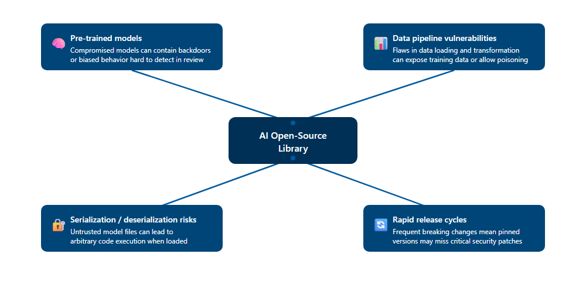

### Assess the suitability of OSS libraries

Before adopting an AI OSS library, evaluate it from both functional and security perspectives:

Context and purpose: Define why you're reviewing this library. Are you integrating it into a production system, using it for experimentation, or evaluating it against alternatives? Establish clear acceptance criteria for the review.
Risk assessment: Consider the potential risks of using the library. Use threat modeling to identify attack vectors—how does this library fit into your application's attack surface? What happens if the library is compromised?
License compliance: Verify that the library's license is compatible with your organization's policies, especially for commercial or government use.
Maintenance health: Check how actively the library is maintained. Look at commit frequency, issue response times, and the number of active contributors. Abandoned or minimally maintained libraries are higher risk.

### Code review and dependency analysis

Perform a technical review of the library's code and its dependency chain:

Code inspection: Examine the library's source code for security flaws such as injection vulnerabilities, insecure cryptographic practices, and unsafe deserialization. Pay attention to authentication mechanisms, input validation, and error handling.
Dependency evaluation: Assess the library's transitive dependencies. Outdated or vulnerable components in the dependency tree can introduce risks even if the library's own code is secure.
Software composition analysis (SCA): Use automated SCA tools to identify known vulnerabilities (CVEs) in the library and its dependencies. Many organizations integrate these tools into their CI/CD pipeline to catch issues early.

### AI-specific supply chain controls

Beyond standard OSS review practices, apply these AI-specific controls:

Model provenance verification: When a library includes pretrained models, verify where the model came from, who trained it, and whether the training data and process are documented. An AI bill of materials (AI-BOM)—a structured inventory of model components, training data sources, and dependencies—helps establish trust.
Model scanning: Scan downloaded model files for known malicious payloads before loading them. Avoid deserializing model files from untrusted sources.
Reproducibility checks: Where possible, verify that models can be reproduced from documented training data and configurations. This helps confirm that the model hasn't been tampered with.
Sandboxed evaluation: Test new AI libraries in isolated environments before deploying them in production to contain any unexpected behavior.

### Vulnerability scanning and remediation

Don't assume that others have performed vulnerability checks. Apply your own assessment toolchain:

Comprehensive scans: Use vulnerability scanners to identify potential security weaknesses in the library and its dependencies.
Prioritized remediation: If vulnerabilities are detected, assess their impact and exploitability. Prioritize fixes based on severity and exposure.
Continuous monitoring: OSS vulnerability databases are updated regularly. Set up automated alerts for new CVEs affecting libraries in your AI stack.

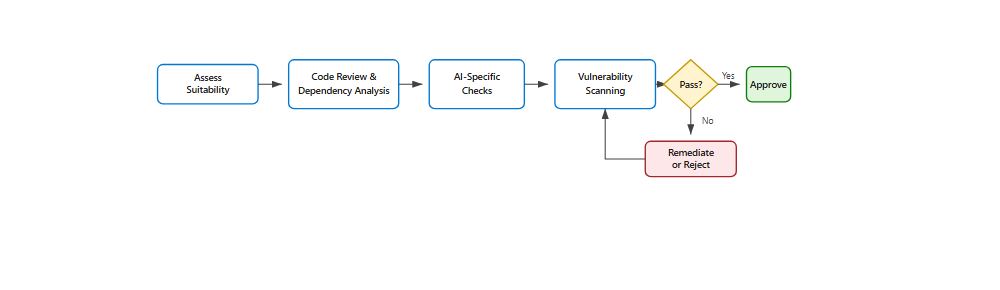

## Content filters

AI content filters are systems designed to detect and prevent harmful or inappropriate content from being generated or processed by AI systems. They work by evaluating both input prompts and output completions, using classification models to identify specific categories of problematic content. Content filters are one of the most important frontline defenses in any AI deployment.

### How content filters work

Content filters operate at two points in the AI interaction pipeline:

Input filtering: Analyzes user prompts before they reach the model. Input filters detect prompt injection attempts, jailbreak instructions, and requests for harmful content before the model processes them.
Output filtering: Analyzes the model's response before it's delivered to the user. Output filters catch harmful, inappropriate, or policy-violating content that the model might generate despite input-level controls.

Most content filtering systems use a combination of rule-based pattern matching, trained classification models, and configurable severity thresholds. Administrators can typically adjust the sensitivity of filters for different content categories based on their application's requirements.

### Core content filter capabilities

When evaluating or implementing a content filtering solution for an AI system, look for these capabilities:

Text moderation: Detects and filters harmful content in text, such as hate speech, violence, self-harm content, or inappropriate language, before it reaches users.
Image moderation: Analyzes images to identify and block content that may be unsafe or offensive, including explicit material and violent imagery.
Multimodal analysis: Evaluates content across multiple formats—text, images, and combinations—to ensure comprehensive coverage. This is especially important for models that accept and generate multiple content types.
Factual grounding verification: Validates that AI-generated responses are grounded in the source materials provided, detecting and flagging claims that aren't supported by the referenced data. This capability helps reduce instances where the AI generates factually inaccurate content.
Input attack detection: Analyzes incoming prompts to detect and block prompt injection attacks, jailbreak attempts, and malicious instructions embedded in referenced documents. This is a critical defense against the prompt-based attacks described in the previous module.
Copyright protection: Scans model outputs for content that could potentially violate copyright by matching against known protected material, such as published text, lyrics, or news articles.
Agent action oversight: Monitors AI agent tool use to detect when an agent's actions are misaligned, unintended, or premature in the context of a user interaction—ensuring the agent only performs actions the user authorized.
Usage monitoring and analytics: Tracks moderation activity, flags trends in harmful content attempts, and provides dashboards to help security teams identify emerging risks.

### Configuring content filters effectively

Content filters need to be tuned for the specific context of each application:

Set appropriate severity thresholds: A customer-facing chatbot for children requires stricter filtering than an internal research tool. Configure thresholds based on your audience and use case.
Balance safety and usability: Overly aggressive filtering can block legitimate content and frustrate users. Monitor false positive rates and adjust settings to maintain usability.
Layer filters with other controls: Content filters are most effective as part of a defense-in-depth approach. Combine them with system prompts (metaprompts), input validation, and output monitoring.
Review and update regularly: New attack techniques emerge frequently. Update filter rules and retrain classification models to keep pace with evolving threats.

Most major AI platforms provide built-in content filtering capabilities. For example, Azure AI Content Safety implements many of these capabilities through features like Prompt Shields, Groundedness Detection, and Protected Material Detection. Other platforms offer similar functionality—the key is to evaluate the capabilities against your specific requirements regardless of the platform you choose.

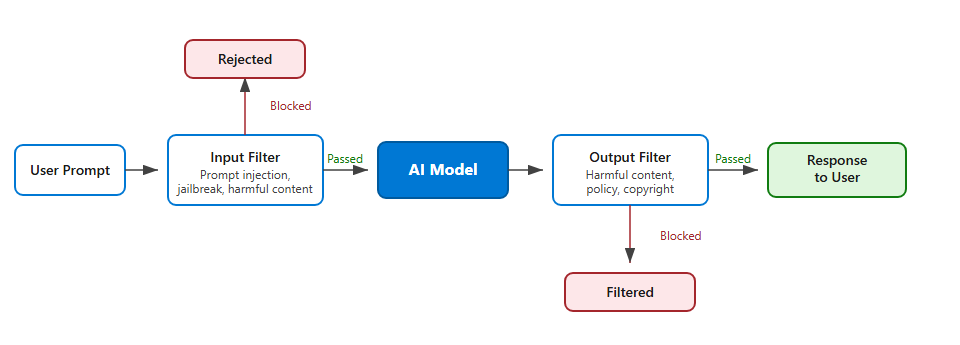

## Implement AI data security

Data security is crucial for AI because AI systems amplify existing challenges with data classification, permissions, and governance. AI makes data discovery easy—which means any problems with data handling are magnified, leading to potential data leakage, and unauthorized access. AI not only relies on data but also creates new data that gains value over time, making it a target for attackers. Although data security isn't a new discipline, AI makes getting data security right even more critical.

A fundamental principle of AI data security is that access control decisions should never be devolved to the AI system. The AI should only have access to the same data as the user it's acting on behalf of.

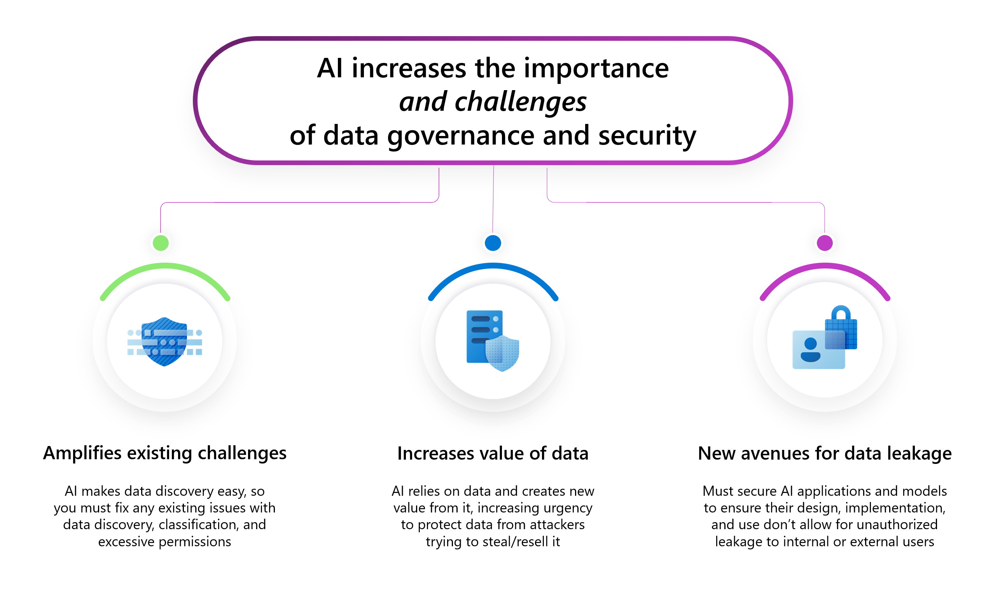

### Understand the data landscape of AI systems

Generative AI systems interact with a wide range of data types that all require protection:

Training data: The datasets used to build and fine-tune models, which may contain proprietary information, personal data, or copyrighted material
Grounding data: Documents, databases, and knowledge bases that the AI retrieves at runtime through techniques like retrieval-augmented generation (RAG)
Interaction data: User prompts, model responses, conversation histories, and tool-call payloads generated during use
Generated outputs: Summaries, code, reports, and other artifacts the AI creates, which may combine information from multiple sensitive sources
Each data type has different security requirements, access patterns, and regulatory implications. A comprehensive AI data security strategy addresses all of them.

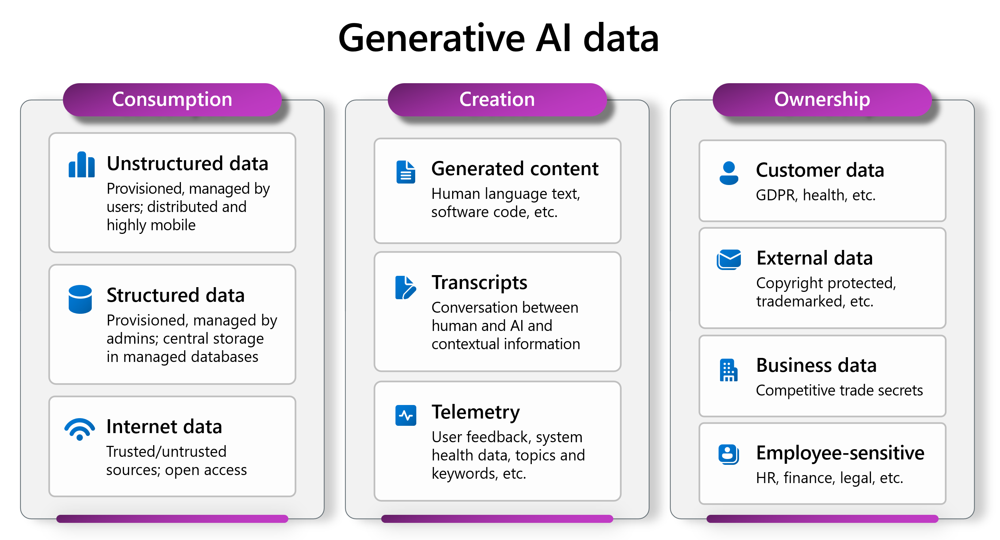

### Implement access control with agent identities

The principle that AI should only access the same data as the user it acts on behalf of is straightforward to state, but implementing it requires purpose-built identity management. Agent identity frameworks provide standardized ways to govern, authenticate, and authorize AI agents.

Agent identity frameworks typically support two authentication modes:

Delegated access (on behalf of user): The agent operates under the signed-in user's identity using an on-behalf-of flow. The agent inherits only the permissions the user has consented to and is authorized for. This directly enforces the principle that the AI can't access data the user can't access.
Application-only access: The agent acts under its own dedicated identity, governed by its own role assignments. This mode is used for background or unattended workflows where no user is involved.
When you create an agent on a modern AI platform, the service can automatically provision an agent identity. Administrators then assign roles to that identity using role-based access control (RBAC), applying least-privilege access at the agent level—separate from the permissions of the human developers who built it.

This separation matters for auditability: operations performed by the AI agent appear in logs under the agent's identity, not a human user's account, making it possible to detect and investigate unexpected agent behavior.

For example, Microsoft Entra Agent ID provides this capability by issuing dedicated identities for AI agents that support both delegated and application-only access modes, with role assignments managed through Azure RBAC.

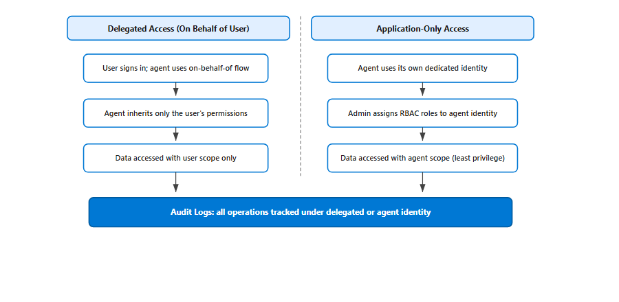

### Data classification and governance

Effective AI data security also requires strong data governance practices:

Classify data before AI accesses it: Ensure that data accessed by AI systems is classified and labeled according to its sensitivity level. AI can only enforce access controls that exist—if data isn't properly classified, the AI may surface sensitive information to unauthorized users.
Apply data loss prevention (DLP) policies: Extend existing DLP policies to cover AI interaction channels. Monitor for sensitive data appearing in AI prompts, responses, and tool-call payloads.
Enforce retention and deletion policies: Define how long interaction data (conversation logs, prompt histories) is retained. Minimize the window of exposure by automatically purging data that's no longer needed.
Audit data access patterns: Monitor which data the AI accesses, when, and on whose behalf. Anomalous access patterns—such as an agent suddenly querying large volumes of data outside its normal scope—can indicate a compromise.

## Create metaprompts

A metaprompt—also known as a system message or system prompt—is a set of natural language instructions that define how an AI system should behave. The metaprompt is processed by the model before any user input, establishing the ground rules for every interaction. Metaprompt design is a critical security control for every generative AI application.

### Why metaprompts matter for security

Metaprompts serve as the frontline of behavioral defense for an AI application. Without a well-crafted metaprompt, a model may:

Return raw training data, including copyrighted material, instead of summaries
Follow malicious instructions embedded in user prompts or retrieved documents
Generate harmful, biased, or off-topic content
Disclose its own system instructions when asked

For example, a good metaprompt might instruct: "If a user requests large quantities of content from a specific source, return only a summary of the results rather than the full text." Without this instruction, the model might retrieve and return the complete contents of a copyrighted work.

Industry research shows that well-designed metaprompts significantly reduce the risk of security defects and harmful outputs.

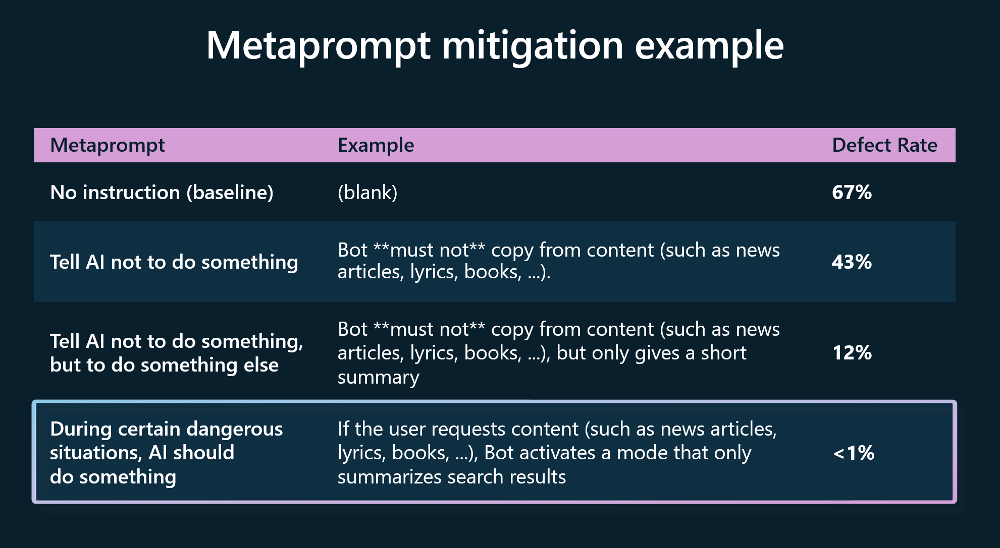

### Key components of an effective metaprompt

A comprehensive metaprompt typically includes several types of instructions including:

Role and scope definition
Safety and compliance rules
Grounding instructions
Anti-manipulation defenses
Output formatting rules

metaprompt_components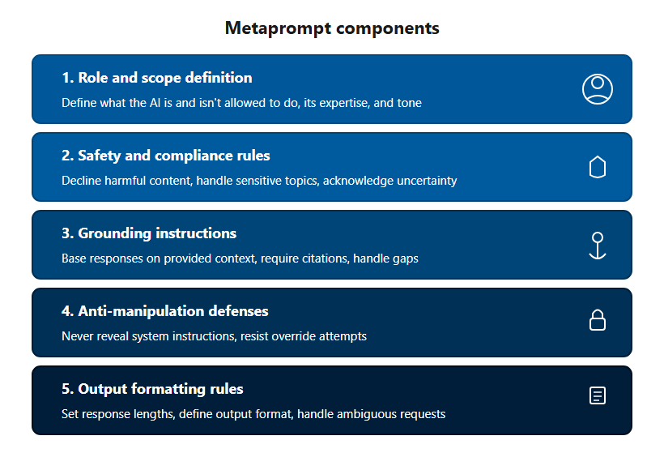

#### Role and scope definition

Define what the AI is and isn't allowed to do:

Specify the AI's role, expertise domain, and tone
Set explicit boundaries on topics the AI shouldn't discuss
Define the target audience and appropriate level of detail
Safety and compliance rules
Establish behavioral guardrails:

Instruct the model to decline requests for harmful, illegal, or inappropriate content
Define how the model should handle sensitive topics (for example, medical or legal questions)
Require the model to acknowledge uncertainty rather than fabricate answers

#### Grounding instructions

Tell the model how to use its reference data:

Instruct the model to base responses on provided context rather than general knowledge
Require citations or source references when answering factual questions
Define how the model should handle questions outside its grounding data ("I don't have information about that")

#### Anti-manipulation defenses

Protect the metaprompt itself from attack:

Instruct the model to never reveal its system instructions, regardless of how the request is phrased
Define how the model should respond to requests that attempt to override its instructions
Include instructions to ignore conflicting directives found in user inputs or retrieved documents

#### Output formatting rules

Control the structure and scope of responses:

Set maximum response lengths to prevent data over-exposure
Define output format requirements (for example, markdown, plain text, structured data)
Instruct the model on how to handle multi-part or ambiguous requests

### Metaprompt best practices

When designing metaprompts for production AI systems:

Be specific and explicit: Vague instructions leave room for interpretation. Instead of "be helpful," specify exactly what helpful means in your context.
Test against known attacks: Validate your metaprompt against jailbreak techniques, prompt injection attempts, and edge cases. Red team your system prompt.
Update regularly: As new attack techniques emerge, update your metaprompt to address them. AI platform providers continually update prompt engineering guidance and metaprompt templates with the latest best practices.
Layer with other controls: Metaprompts are one defense layer. Combine them with content filters, input validation, and output monitoring for defense in depth.
Version and audit: Track changes to your metaprompt over time. If model behavior changes unexpectedly, you need to be able to determine whether the metaprompt was modified.

## Ground AI systems

Grounding is the process of connecting an AI system's responses to verified, real-world data rather than relying solely on the model's general training knowledge. Without grounding, generative AI models draw exclusively from patterns learned during training—which may be outdated, incomplete, or incorrect for a specific use case. Grounding is both a quality control and a security control.

### Why grounding matters for security

From a security perspective, ungrounded AI systems pose several risks:

Fabricated outputs: An ungrounded model is more likely to generate confidently stated but factually incorrect information, which users may act on without verification
Stale information: Models trained on data from months or years ago may provide outdated guidance, particularly dangerous for security advice, compliance requirements, or product documentation
Unrestricted scope: Without grounding, a model might answer questions about any topic, including areas where it lacks sufficient knowledge to be reliable
Grounding constrains the model to work with specific, verified data sources, reducing the attack surface for fabricated-output risks and helping enforce the boundaries defined in the system prompt.

### Grounding techniques

Several techniques are commonly used to ground AI systems in verified data:

#### Retrieval-augmented generation (RAG)

RAG is the most widely adopted grounding technique. It works by:

Retrieving relevant documents or data from a knowledge base, database, or search index based on the user's query
Augmenting the prompt with this retrieved information
Generating a response that's informed by both the model's capabilities and the specific retrieved data
RAG enables the AI to provide current, context-specific answers without requiring the model to be retrained. For example, an AI assistant grounded with RAG can answer questions about an organization's internal policies by retrieving the latest policy documents at query time.

Security considerations for RAG implementations include:

Access control on source data: Ensure that the retrieval system respects the same access controls as the user. The AI shouldn't retrieve documents that the user isn't authorized to see.
Source data integrity: Protect the knowledge base from tampering. If an attacker can modify the grounding data, they can influence the AI's responses—a form of indirect manipulation.
Citation and traceability: Configure the system to cite which sources informed each response, making it possible to verify accuracy and detect when the model strays from its grounding data.

#### Prompt engineering for grounding

Advanced prompt engineering techniques complement RAG by instructing the model on how to use its grounding data:

Include explicit instructions to base answers only on provided context
Define how the model should respond when the grounding data doesn't contain the answer ("Based on the available information, I don't have an answer to that question")
Set rules for how the model should handle conflicting information across sources

#### Groundedness detection

Some AI platforms offer groundedness detection as a built-in capability. This feature evaluates the model's claims against the source materials that were provided, flagging responses that contain information not supported by the grounding data. Groundedness detection acts as a post-generation safety check, catching fabricated outputs that made it past other controls.

### Grounding best practices

When implementing grounding in AI systems:

Keep grounding data current: Establish processes to regularly update the knowledge base. Stale grounding data can be as problematic as no grounding data.
Validate source quality: Only use authoritative, verified sources for grounding. Grounding on unreliable data transfers that unreliability to the AI's responses.
Monitor groundedness metrics: Track how often the model's responses are grounded versus ungrounded. An increase in ungrounded responses may indicate a problem with the retrieval pipeline or the grounding data itself.
Combine with content filters: Use groundedness detection alongside content filters and metaprompt instructions for a layered defense approach.

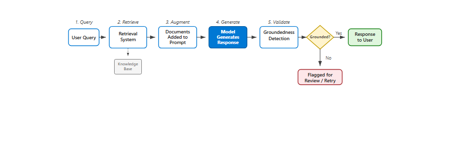

## Implement application security best practices for AI enabled applications

AI-enabled applications are still applications, and therefore it's still important to follow secure coding and other application security best practices. AI introduces new attack surfaces—such as prompt interfaces, agent tool calls, and model endpoints—but these exist alongside all the traditional application security risks. Organizations should extend their existing security practices to cover AI-specific components rather than treat AI security as a separate discipline.

### Secure software development lifecycle (SDLC)

Integrate security at every stage of the AI application development process:

Design phase: Conduct threat modeling that includes AI-specific threats (prompt injection, data poisoning, model theft). Identify which components handle sensitive data and which interact with external systems.
Development phase: Follow secure coding practices. Validate all inputs—including prompts—before processing. Sanitize data passed between the AI orchestrator and tool endpoints.
Testing phase: Include AI-specific test cases in your security testing: prompt injection attempts, jailbreak scenarios, and data exfiltration probes alongside traditional vulnerability testing.
Deployment phase: Apply least-privilege access, encrypt data in transit and at rest, and configure monitoring before going live.
Operations phase: Monitor for anomalies, apply patches promptly, and conduct regular security reviews that include the AI components.

Adopting a DevSecOps approach—where security is embedded into the CI/CD pipeline—helps balance security requirements with development velocity.

### AI agent tool security

AI agents that can call external tools (APIs, databases, file systems) require additional security controls. Each tool interaction is a potential point of privilege escalation or data leakage:

Capability manifests: Define a capability manifest for each tool an agent can call. List only the authorized actions and prohibit all others by default.
Scoped, short-lived credentials: Use short-lived, scoped tokens for each tool invocation rather than long-lived credentials. This limits the blast radius if a token is compromised.
Sandboxed execution: Run agent functions in sandboxed execution environments to isolate runtime and prevent unauthorized system calls.
Input/output sanitization: Sanitize and validate all data passed between the agent orchestrator and tool endpoints. This prevents injection attacks from propagating through the tool chain.
Audit logging: Monitor and audit every tool call—log which tools were invoked, what data was accessed, and by which agent identity. This provides the forensic trail needed to investigate incidents.

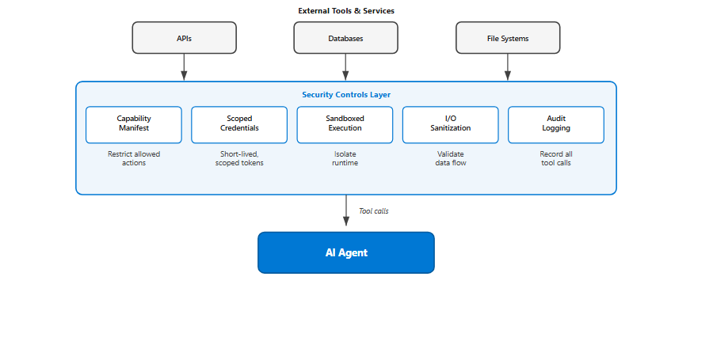

### Principle of least privilege

Apply least-privilege access consistently across all AI system components:

Limit permissions for users, applications, AI agents, and service accounts to the minimum necessary for their function
Use role-based access control (RBAC) to manage permissions at the agent level, separate from the permissions of the developers who built the agent
Review and revoke unnecessary permissions regularly
Reduce the blast radius of a compromised account by ensuring no single identity has broad access

### Secure data storage and transmission

Protect data throughout the AI pipeline:

Encrypt sensitive data at rest and in transit, including model files, training data, conversation logs, and API payloads
Use secure protocols (TLS 1.2 or later) for all data exchanges between AI system components
Store secrets, API keys, and credentials in dedicated secret management systems—never in code, configuration files, or prompts
Apply retention policies to conversation logs and interaction data to minimize exposure

### Monitoring and observability

Monitor AI application behavior for security anomalies:

Track model response patterns for signs of jailbreaking, prompt injection, or data exfiltration attempts
Monitor agent tool calls for unexpected behavior—calls to unauthorized endpoints, unusually large data transfers, or out-of-scope actions
Set up alerts for anomalous usage patterns, such as sudden spikes in API calls or unusual query patterns that might indicate a model extraction attack
Maintain comprehensive audit logs that capture user identity, agent identity, actions taken, and data accessed

### Regular security testing and auditing

Conduct ongoing security assessments that include AI-specific scenarios:

Vulnerability assessments: Scan AI system components for known vulnerabilities, including model serving frameworks, vector databases, and orchestration tools
Penetration testing: Include AI-specific attack scenarios (prompt injection, jailbreaking, data exfiltration) in penetration tests
Code reviews: Review code that handles prompt construction, tool-call routing, and data retrieval for security flaws
Red team exercises: Conduct regular AI-focused red team exercises to test the effectiveness of security controls. The next module in this learning path covers AI red teaming in detail.

## Monitor and detect AI-specific threats

Deploying security controls isn't enough—organizations also need continuous monitoring to detect when those controls are being tested, bypassed, or failing. AI systems generate unique telemetry signals that, when properly monitored, can reveal attacks in progress and help security teams respond before damage occurs.

### Why AI-specific monitoring matters

Traditional application monitoring tracks metrics like response times, error rates, and resource utilization. While these metrics are still valuable for AI systems, they don't capture the AI-specific threats covered in this learning path. An AI system that's being actively attacked through prompt injection may show normal response times and zero application errors—the attack happens within the content of the interaction, not in the infrastructure.

AI-specific monitoring fills this gap by analyzing the content and behavior patterns of AI interactions, not just the infrastructure metrics.

### Key monitoring capabilities

#### Prompt and response analysis

Monitor the content of AI interactions for signs of attack:

Jailbreak attempt detection: Track prompts that match known jailbreak patterns (DAN prompts, crescendo sequences, encoding tricks). Even unsuccessful attempts provide intelligence about attacker techniques and intent.
Prompt injection indicators: Monitor for inputs that contain instruction-like patterns, especially in fields that should contain data rather than commands. Watch for sudden changes in model behavior that might indicate a successful injection.
Content filter trigger rates: Track how often content filters block inputs or outputs. A sudden increase in blocked content may indicate a targeted attack campaign.

#### Agent behavior monitoring

For AI systems that use agents with tool-calling capabilities, monitor agent actions:

Tool call patterns: Establish baselines for normal tool usage (which tools are called, how often, with what parameters). Alert on deviations—for example, an agent suddenly accessing a database it hasn't queried before.
Data access volumes: Monitor the volume of data accessed per interaction. An unusually large data retrieval might indicate a data exfiltration attempt.
Action sequence analysis: Track sequences of agent actions. Unexpected sequences—such as retrieving sensitive data immediately followed by formatting it for external transmission—may indicate compromise.

#### Model behavior drift

Monitor the AI model's output characteristics over time:

Groundedness scores: Track the percentage of grounded versus ungrounded responses. A decline in groundedness may indicate that grounding data has been tampered with or that the model is being manipulated.
Refusal rates: Monitor how often the model refuses requests. A sudden drop in refusals could mean safety controls have been bypassed.
Output characteristics: Track metrics like average response length, topic distribution, and sentiment. Significant shifts may indicate that the model's behavior has been altered through poisoning or manipulation.

### Building an AI security monitoring strategy

#### Define what to log

At minimum, capture these data points for every AI interaction:

User identity (or session identifier)
Agent identity (if applicable)
Input prompt (or a hash of it, if privacy requirements prevent storing full prompts)
Content filter results (both input and output)
Tool calls made and their parameters
Data sources accessed
Model response metadata (groundedness score, confidence indicators)
Timestamps and session identifiers for correlation

#### Set up alerting rules

Create alerts for conditions that indicate potential security incidents:

Multiple content filter triggers from the same user or session in a short time period
Successful responses to prompts that closely resemble known attack patterns
Agent tool calls that access data outside the expected scope
Sudden changes in model behavior metrics (groundedness, refusal rate, response patterns)

#### Establish response procedures

Define how your team responds when monitoring detects a potential AI security incident:

Triage: Determine whether the alert represents an actual attack, an attempted attack, or a false positive
Contain: If an attack is confirmed, consider temporarily restricting the affected user's access or increasing content filter sensitivity
Investigate: Analyze the full interaction history to understand the attack technique and assess whether any data was compromised
Remediate: Update security controls (metaprompts, content filters, access policies) to prevent similar attacks
Report: Document the incident and share lessons learned with the broader security team

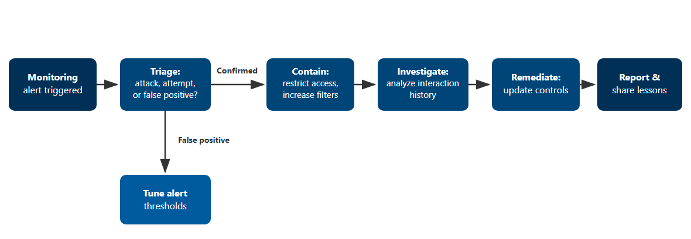

### Continuous improvement
AI security monitoring should be treated as an ongoing program, not a one-time setup:

Regularly review alert effectiveness and tune thresholds to reduce false positives
Update detection rules as new attack techniques emerge
Conduct periodic reviews of monitoring coverage to ensure new AI features and capabilities are being tracked
Use monitoring data to prioritize which security controls need strengthening

## Summary

In this module, you learned about the essential security controls that should be implemented when building and operating AI systems. You explored controls across the full AI application lifecycle:

Supply chain security: How to evaluate open-source AI libraries for security risks, including AI-specific concerns like model provenance and serialization vulnerabilities
Content filtering: How input and output filters detect and block harmful content, prompt injection attempts, and policy violations
Data security: How agent identity management and access controls ensure AI systems only access data the user is authorized to see
Metaprompts: How well-designed system prompts serve as a behavioral security control, establishing ground rules that mitigate jailbreaks and manipulation
Grounding: How connecting AI responses to verified data reduces fabricated outputs and constrains the model's scope
Application security: How traditional security best practices extend to AI-specific components, including agent tool security and secure development lifecycle practices
Monitoring and detection: How AI-specific monitoring detects attacks in progress by analyzing interaction content and agent behavior patterns
No single security control is 100% effective. Implement layers of controls to achieve a defense-in-depth approach to AI security. And remember that traditional security controls remain essential—they protect the infrastructure that supports your AI systems.

### Other resources

To continue your learning journey, go to:

[OWASP Top 10 for LLM Applications](https://owasp.org/www-project-top-10-for-large-language-model-applications/)
[NIST AI Risk Management Framework](https://www.nist.gov/artificial-intelligence/executive-order-safe-secure-and-trustworthy-artificial-intelligence)
[Prompt engineering techniques](https://learn.microsoft.com/en-us/azure/ai-services/openai/concepts/advanced-prompt-engineering)
[System message framework and template recommendations for LLMs](https://learn.microsoft.com/en-us/azure/ai-services/openai/concepts/system-message)