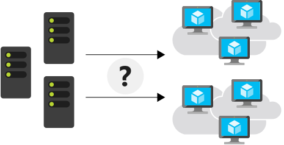
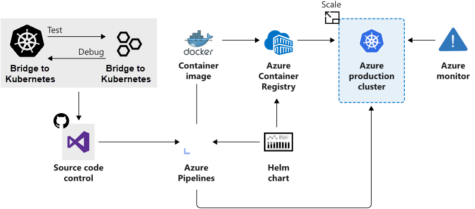

# Introduction

Using containers in software development is popular because of the ease of use and versatility. Containers make it easy to package and deploy an application to any compute environment for tests, scale, and production. When your application meets higher demand, you can easily scale out your services by deploying more container instances. Containers are also less resource intensive than virtual machines. This efficiency allows you to make better use of compute resources, and that saves you money.

The standard container-management runtime is focused on managing individual containers. However, there are times where you want to scale and have multiple containers working together. Scaling multiple containers becomes challenging, because several factors need consideration when managing multiple containers. Suppose you need to handle load balancing, security, network connectivity, and deployment. To help make this process easier, it's common to use a container-management platform such as Kubernetes.

Suppose you run a company that provides an asset-tracking solution to customers worldwide. Your tracking solution is built and deployed as microservices, which are then packaged into containers. You're using the containerized instances to quickly deploy into new customer regions and scale resources as needed to meet customer demand globally. You're tasked to use a container-orchestration platform that simplifies the process to develop, deploy, and manage containerized applications.

In this module, you learn how Azure Kubernetes Service (AKS) makes it simple to manage a hosted Kubernetes environment in Azure. We hope to aid you in your decision on whether AKS is a good choice as a Kubernetes platform for your business.

## Learning objectives

In this module:

Evaluate whether Azure Kubernetes Service is an appropriate Kubernetes orchestration platform for you.
Describe how the components of Azure Kubernetes Service work to support compute container orchestration.

### Prerequisites

Basic understanding of microservices

## What is Azure Kubernetes Service?

Let's start with a few definitions and a quick tour through the Azure Kubernetes Service (AKS). This overview provides information to help you decide if AKS is a good platform for your containerization management strategy.

### What is a container?

A container is an atomic unit of software that packages code, dependencies, and configuration for a specific application. Containers allow you to split monolithic applications into individual services that make up the solution. This rearchitecting of our application enables us to deploy these separate services via containers.

### Why use a container?

Suppose your asset-tracking solution included three major applications:

A tracking website that includes maps and information about the assets being tracked.
A data processing service that collects and processes information sent from tracked assets.
An MSSQL database for storing customer information captured from the website.
You realize that to meet customer demand, you have to scale out your solution.

#### Virtual Machines (VMs)

One option is to deploy a new virtual machine for every application, hosted across multiple regions. Then, copy the applications to your new VMs. However, doing so makes you responsible for managing each VM that you use.

The maintenance overhead increases as you scale. You need to deploy and configure VM operating system (OS) versions and dependencies for each application to match. When you apply upgrades for your applications that affect the OS and major changes, there are precautions. If any errors appear during the upgrade, you need to roll back the installation, which causes disruption like downtime or delays.

The deployment of Vm's is cumbersome, sometimes error-prone, and doesn't easily scale single services. For example, you can't easily scale only the caching service used in the web application. Containers help solve these types of problems.

The container concept gives us four major benefits:

*Immutability*: The unchanging nature of a container allows it to deploy and run reliably with the same behavior from one compute environment to another. A container image tested in a QA environment is the same container image deployed to production.
*Smaller Size*: A container is similar to a VM, but without the kernel for each machine. Instead, they share a host kernel. VMs use a large image file to store both the OS and the application you want to run. In contrast, a container doesn't need an OS, only the application.
*Lightweight*: The container always relies on the host-installed OS for kernel-specific services. The lightweight property makes containers less resource-intensive, so installing multiple containers is possible within the same compute environment.
*Startup is fast*: Containers start up in few seconds, unlike VMs, which can take minutes to start.

These benefits make containers a popular choice for developers and IT operations alike, and are why many are switching from VMs.

### What is container management?

Even though containers are functionally similar to VMs, their purposes vary. A container has a distinct lifecycle that exists as a temporary machine. Its state passes through the stages of pending, running, and terminated. This lifecycle makes containers more disposable and affects how developers and IT operations think about the management of large interconnected applications. Container management involves deploying, upgrading, monitoring, and removing containers.

For example, suppose that you discover that at noon there's more site traffic, so you need more instances of the site's caching service to manage performance. You plan to solve this problem by adding more caching service containers.

Now it's time to roll out a new version of your caching service. How do you update all the containers? How do you remove all the older versions?

These types of load-balancing questions require a system to manage your container deployment.

### What is Kubernetes?

Kubernetes is a portable, extensible, open-source platform that automates deploying, scaling, and managing containerized workloads. Kubernetes abstracts away complex container management and provides us with a declarative configuration to orchestrate containers in different compute environments. This orchestration platform gives us the same ease of use and flexibility as with Platform as a Service (PaaS) and Infrastructure as a Service (IaaS) offerings.

Kubernetes allows you to view your data center as one large computer. We don't worry about how and where we deploy our containers, only about deploying and scaling our applications as needed.

Here are some more aspects to keep in mind about Kubernetes:

Kubernetes isn't a full PaaS offering. It operates at the container level and offers only a common set of PaaS features.
Kubernetes installations aren't a monolithic, single application. Aspects like deployment, scaling, load balancing, logging, and monitoring are all optional.
Kubernetes doesn't limit the types of applications you can run. If your application can run in a container, it runs on Kubernetes.
Your developers need to understand concepts like microservices architecture to make optimal use of container solutions.
Kubernetes doesn't provide middleware, data-processing frameworks, databases, caches, or cluster-storage systems. All these items are run as containers or as part of another service offering.
A Kubernetes deployment is configured as a cluster. A cluster consists of a Microsoft managed control plane and one or more worker nodes (agent nodes). For production deployments, the preferred configuration is a Microsoft managed, high availability replicated control plane and worker nodes that run your workloads and that you manage with node pools.

With all the benefits you receive with Kubernetes, you're responsible for finding the best solution that fits your needs to address these aspects. Keep in mind that you're responsible for maintaining your Kubernetes cluster. For example, you need to manage OS upgrades and the Kubernetes installation and upgrades. You also manage the hardware configuration of the host machines, like networking, memory, and storage.

> Note
> Kubernetes is sometimes abbreviated to K8s. The 8 represents the eight characters between the K and the s of the word K<ubernete>s.

### Azure Kubernetes Service (AKS)

AKS manages your hosted Kubernetes environment and makes it simple to deploy and manage containerized applications in Azure. Your AKS environment is enabled with features like automated updates, self-healing, and easy scaling. Azure manages your Kubernetes cluster's control plane for free. You manage the agent nodes in the cluster and only pay for the VMs on which your nodes run.

You can create and manage your cluster in the Azure portal or with the Azure CLI. When you create the cluster, there are Resource Manager templates to automate cluster creation. With these templates, you have access to features like advanced networking options, Microsoft Entra Identity, and resource monitoring. Then, you can set up triggers and events to automate the cluster deployment for multiple scenarios.

With AKS, you get the benefits of open-source Kubernetes without the added complexity or operational overhead that using only Kubernetes can entail.

## How Azure Kubernetes Service works

Now that you're familiar with the basics of Azure Kubernetes Service (AKS), let's see what information you need to set up a simple AKS cluster. This information should help you to understand how AKS integrates with existing development and deployment processes.

### Create an AKS cluster

At its core, an AKS cluster is a cloud-hosted Kubernetes cluster. Unlike a custom Kubernetes installation, AKS streamlines the installation process and takes care of most of the underlying cluster-management tasks.

You have two options when you create an AKS cluster: you can either use the Azure portal or Azure CLI. Both options require you to configure basic information about the cluster. For example, you configure:

The Kubernetes cluster name.
The version of Kubernetes to install.
A DNS prefix to make the control plane node publicly accessible.
The initial node pool size.

The initial node pool size defaults to two nodes, but we recommend that you use at least three nodes for a production environment.

> Note
> The control-plane node in your cluster is free. You only pay for node virtual machines (VM), storage, and networking resources consumed in your cluster.

Unless you specify otherwise, the Azure service-creation workflow creates a Kubernetes cluster using the default configuration for scaling, authentication, networking, and monitoring. Creating an AKS cluster typically takes a few minutes. After the AKS cluster is created, you can change any of its default properties. You can manage your cluster with the Azure portal or from the command line.

### How workloads are developed and deployed to AKS

AKS supports the Docker image format. With a Docker image, you can use any development environment to create a workload, package the workload as a container, and deploy the container as a Kubernetes pod.

You use the standard Kubernetes command-line tools or the Azure CLI to manage your deployments. The support for the standard Kubernetes tools ensures that you don't need to change your current workflow to support an existing Kubernetes migration to AKS.

AKS also supports popular development and management tools such as Helm, Draft, the Kubernetes extension for Visual Studio Code, and Visual Studio Kubernetes Tools.

### Bridge to Kubernetes

Bridge to Kubernetes allows you to run and debug code on your development computer while still being connected to your Kubernetes cluster and the rest of your application or services.

With Bridge to Kubernetes, you can:

Avoid having to build and deploy code to your cluster. Instead, you create a direct connection from your development computer to your cluster. That connection allows you to quickly test and develop your service in the context of the full application without creating a Docker or Kubernetes configuration for that purpose.
Redirect traffic between your connected Kubernetes cluster and your development computer. The bridge allows code on your development computer and services running in your Kubernetes cluster to communicate as if they are in the same Kubernetes cluster.
Replicate environment variables and mounted volumes available to pods in your Kubernetes cluster to your development computer. With Bridge to Kubernetes, you can modify your code without having to replicate those dependencies manually.

### Azure Service Integration

AKS allows you to integrate any Azure service offering and use it as part of an AKS cluster solution.

For example, remember that Kubernetes doesn't provide middleware and storage systems. Suppose you need to add a processing queue to the fleet management data processing service. You can easily integrate Azure Storage queues to extend the capacity of the data processing service.

## When to use Azure Kubernetes Service

You can decide whether Azure Kubernetes Service (AKS) is the right choice for you.

You can either approach your decision from a green field project or a lift-and-shift project point of view. A green field project allows you to evaluate AKS based on default features. A lift-and-shift project forces you to look at which features are best suited to support your migration.

Earlier, you learned about AKS support for DevOps capabilities through Azure. The following table lists Azure resources you should consider to enhance your AKS cluster. These features each represent compelling factors for why customers choose AKS.

Service | Consideration
Identity and security management | Do you already use existing Azure resources and make use of Microsoft Entra ID? You can configure an AKS cluster to integrate with Microsoft Entra ID and reuse existing identities and group membership.
Integrated logging and monitoring | AKS includes Azure Monitor for containers to provide performance visibility into the cluster. With a custom Kubernetes installation, you decide on a monitoring solution that requires installation and configuration.
Auto Cluster node and pod scaling | Deciding when to scale up or down in a large containerization environment is tricky. AKS supports two auto cluster scaling options. You can use either the horizontal pod autoscaler or the cluster autoscaler to scale the cluster. The horizontal pod autoscaler watches the resource demand of pods and increases pod resources to match demand. The cluster autoscaler component watches for pods that can't be scheduled because of node constraints. It automatically scales cluster nodes to deploy scheduled pods.
Cluster node upgrades | Do you want to reduce the number of cluster-management tasks? AKS manages Kubernetes software upgrades and the process of cordoning off nodes and draining them to minimize disruption to running applications. Once done, these nodes are upgraded one at a time.
GPU enabled nodes | Do you have compute-intensive or graphic-intensive workloads? AKS supports GPU-enabled node pools.
Storage volume support | Is your application stateful, and does it require persisted storage? AKS supports both static and dynamic storage volumes. Pods can attach and reattach to these storage volumes as they're created or rescheduled on different nodes.
Virtual network support | Do you need pod-to-pod network communication or access to on-premises networks from your AKS cluster? An AKS cluster can be deployed into an existing virtual network.
Ingress with HTTP application-routing support | Do you need to make your deployed applications publicly available? The HTTP application-routing add-on makes it easy to access AKS cluster deployed applications.
Docker image support | Do you already use Docker images for your containers? AKS supports the Docker file image format by default.
Private container registry | Do you need a private container registry? AKS integrates with Azure Container Registry (ACR). You aren't limited to ACR; you can use other container repositories, whether public or private.

All of these features are configurable, either when you create the cluster or following deployment.

## Summary

Our goal was to help you evaluate whether Azure Kubernetes Service (AKS) would be a good choice as a Kubernetes-orchestration platform for your business. We looked at several features that enhance the AKS Kubernetes offering. We learned how these features can help you decide if AKS is a good fit for new projects, or convince you to move from another Kubernetes solution to Azure.

We also learned how AKS makes use of familiar concepts such as:

The Docker file format for creating containers.
Popular development and management tools such as Helm, Draft, the Kubernetes extension for Visual Studio Code, and Visual Studio Kubernetes Tools.
Integration with Azure DevOps Projects to simplify setting up a DevOps pipeline for your application.

You were looking for a container orchestration platform to quickly deploy your fleet management solution into new customer regions. AKS allows you to manage your hosted Kubernetes environment and makes it simple to develop, deploy, and manage containerized applications in Azure.

You don't need to manage the cluster infrastructure, and you only pay for what you use. It streamlines the installation process and takes care of most of the underlying cluster-management tasks.

Finally, AKS is part of Azure, and you can integrate it with other Azure services to extend your product or exchange data with other services.