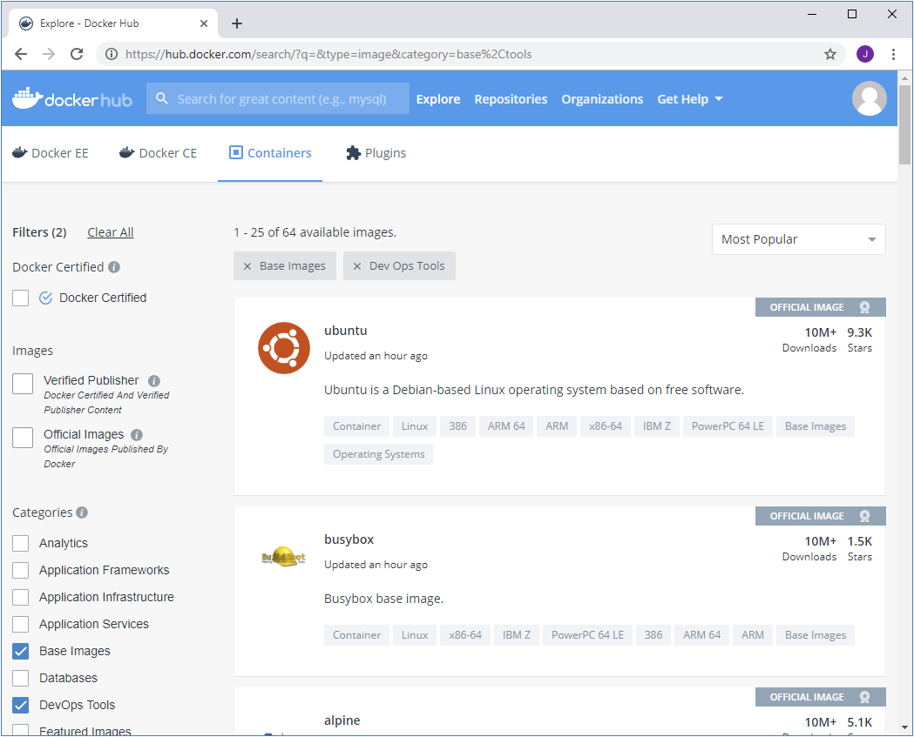

# Introduction

Rapid deployment is key to business agility. Modern organizations must be able to release apps quickly to attract and retain business. Containerization saves time and reduces costs. You don't have to configure hardware and spend time installing operating systems and software to host a deployment. Multiple apps can run in their isolated containers on the same hardware. You can scale out quickly by starting more instances of containers. The images that run in containers are extensible; you can start with a working base image and layer more functionality on top to create a new image.

Suppose you work for an online clothing retailer that's planning to deploy a handful of internal apps, but it hasn't yet decided how to host them. You're looking for maximum compatibility, and the apps could be hosted on-premises, in Azure, or in another cloud provider. Some of the apps might share infrastructure as a service (IaaS) infrastructure. In these cases, the company requires the apps to be isolated from each other. Apps can share the hardware resources, but an app shouldn't be able to interfere with the files, memory space, or other resources the other apps use. The company values the efficiency of its resources and wants something with a compelling app-development story. Docker seems an ideal solution to these requirements. With Docker, you can quickly build and deploy an app and run it in its tailored environment, either locally or in the cloud.

In this module, you'll take an existing application and package it as a Docker image. You'll automate the image-build process by defining the build steps in a Dockerfile. You'll test the app locally by using Docker for Windows. Finally, you'll upload the image to Azure Container Registry and run the application using the Azure Container Instance service.

By the end of this module, you'll be able to build Docker images and run them from Azure.

## Learning objectives

In this module, you will:

Create a Dockerfile for a new container image based on a starter image from Docker Hub.
Add files to an image using Dockerfile commands.
Configure an image's startup command with Dockerfile commands.
Build and run a web application packaged in a Docker image.
Deploy a Docker image using the Azure Container Instance service.

### Prerequisites

An active Azure subscription
Familiarity with basic web application development concepts

## Retrieve an existing Docker image and deploy it locally

Docker is a technology that allows you to deploy applications and services quickly and easily. A Docker app runs using a Docker image. A Docker image is a prepackaged environment containing the application code and the environment in which the code executes.

In the corporate scenario we described earlier, you want to investigate the feasibility of packaging and running an app with Docker. You decide to build and deploy a Docker image running a test web app.

In this unit, you'll learn about the key concepts and processes involved in running a containerized app stored in a Docker image.

### Docker overview

Docker is a tool for running containerized apps. A containerized app includes the app and the filesystem that makes up the environment in which it runs. For example, a containerized app could consist of a database and other associated software and configuration information needed to run the app.

A containerized app typically has a much smaller footprint than a virtual machine configured to run the same app. This smaller footprint is because a virtual machine has to supply the entire operating system and associated supporting environment. A Docker container doesn't have this overhead, because Docker uses the host computer's operating-system kernel to power the container. Downloading and starting a Docker image is faster and more space-efficient than downloading and running a virtual machine that provides similar functionality.

You create a containerized app by building an image that contains a set of files and a section of configuration information Docker uses. You run the app by asking Docker to start a container based on the image. When the container starts, Docker uses the image configuration to determine what application to run inside the container. Docker provides the operating system resources and the necessary security. It ensures that containers are running concurrently and remain relatively isolated.

> Important
> Docker doesn't provide the level of isolation available with virtual machines. A virtual machine implements isolation at the hardware level. Docker containers share underlying operating system resources and libraries. However, Docker ensures that one container can't access another's resources unless the containers are configured to do so.

You can run Docker on your desktop or laptop if you're developing and testing locally. For production systems, Docker is available for server environments, including many variants of Linux and Microsoft Windows Server 2016. Many vendors also support Docker in the cloud. For example, you can store Docker images in Azure Container Registry and run containers with Azure Container Instances.

In this module, you'll use Docker locally to build and run an image. Then, you'll upload the image to Azure Container Registry and run it in an Azure Container Instance. This version of Docker is suitable for developing and testing Docker images locally.

### Linux and Windows Docker images

Docker was initially developed for Linux and has since expanded to support Windows. Individual Docker images are either Windows-based or Linux-based, but can't be both at the same time. The image's operating system determines what kind of operating system environment is used inside the container.

Docker image authors who wish to offer similar functionality in both Linux-based and Windows-based images can build those images separately. For example, Microsoft offers Windows and Linux Docker images containing an ASP.NET Core environment that you can use as the basis for containerized ASP.NET Core applications.

Linux computers with Docker installed can only run Linux containers. Windows computers with Docker installed can run both kinds of containers. Windows runs both by using a virtual machine to run a Linux system, and uses the virtual Linux system to run Linux containers.

This modulewill focus on Linux-based images.

### Docker registries and Docker Hub

Docker images are stored and made available in registries. A registry is a web service to which Docker can connect to upload and download container images. The most well-known registry is Docker Hub, which is a public registry. Many individuals and organizations publish images to Docker Hub, and you can download and run these images using Docker running on your desktop, on a server, or in the cloud. You can create a Docker Hub account and upload your images there for free.

A registry is organized as a series of repositories. Each repository contains multiple Docker images that share a common name and generally the same purpose and functionality. These images normally have different versions, identified with a tag. This mechanism enables you to publish and retain multiple versions of images for compatibility reasons. When you download and run an image, you must specify the registry, repository, and version tag for the image. Tags are text labels, and you can use your version numbering system (v1.0, v1.1, v1.2, v2.0, and so on).

Suppose you want to use the ASP.NET Core Runtime Docker image. This image is available in two versions:

9.0: mcr.microsoft.com/dotnet/aspnet:9.0
8.0 (Long-Term Support): mcr.microsoft.com/dotnet/aspnet:9.0

Now, let's suppose you want to use the .NET Core samples Docker images. Here we have four versions available from which to choose:

mcr.microsoft.com/dotnet/samples:dotnetapp
mcr.microsoft.com/dotnet/samples:dotnetapp-chiseled
mcr.microsoft.com/dotnet/samples:aspnetapp
mcr.microsoft.com/dotnet/samples:aspnetapp-chiseled

> Note
> A single image can have multiple tags assigned to it. By convention, the most recent version of an image is assigned the latest tag in addition to a tag that describes its version number. When you release a new version of an image, you can reassign the latest tag to reference the new image.

A repository is also the unit of privacy for an image. If you don't wish to share an image, you can make the repository private. You can grant access to other users with whom you want to share the image.

### Browse Docker Hub and pull an image

Often you'll find there's an image in Docker Hub that closely matches the type of app you want to containerize. You can download such an image and extend it with your application code.

Docker Hub contains many thousands of images. You can search and browse a registry using Docker from the command line or the Docker Hub website. The website allows you to search, filter, and select images by type and publisher. The figure below shows an example of the search page.



You use the `docker pull` command with the image name to retrieve an image. By default, Docker will download the image tagged `latest` from that repository on Docker Hub if you specify only the repository name. Keep in mind that you can modify the command to pull different tags and from different repositories.

```bash
docker pull [path-to-repository]:[image-name]
```

When you fetch an image, Docker stores it locally and makes it available for running containers. You can view the images in your local registry with the `docker image` list command.

The output looks like the following example:

```bash
REPOSITORY TAG IMAGE ID CREATED SIZE
mcr.microsoft.com/dotnet/samples   aspnetapp           6e2737d83726        6 days ago          263MB
```

You can use the image name ID to reference the image in many other Docker commands.

### Run a Docker container

Use the `docker run` command to start a container. Specify the image to run with its name or ID. If you haven't docker pulled the image already, Docker will do it for you.

```bash
docker run mcr.microsoft.com/dotnet/samples:aspnetapp
```

> Note
> This example fetches the image with the tag aspnetapp from the mcr.microsoft.com/dotnet/samples:aspnetapp repository. This image contains a simple ASP.NET Core web app.

In this example, the command responds with the following message:

```bash
warn: Microsoft.AspNetCore.DataProtection.KeyManagement.XmlKeyManager[35]
 No XML encryptor configured. Key {d8e1e1ea-126a-4383-add9-d9ab0b56520d} may be persisted to storage in unencrypted form.
Hosting environment: Production
Content root path: /app
Now listening on: http://[::]:80
Application started. Press Ctrl+C to shut down.
```

This image contains a web app, so it's now listening for requests to arrive on HTTP port 80. However, if you open a web browser and navigate to http://localhost:80, you won't see the app.

By default, Docker doesn't allow inbound network requests to reach your container. You need to tell Docker to assign a specific port number from your computer to a specific port number in the container by adding the `-p` option to docker run. This instruction enables network requests to the container on the specified port.

Additionally, the web app in this image isn't meant to be used interactively from the command line. When we start it, we want Docker to start it in the background and just let it run. Use the `-d` flag to instruct Docker to start the web app in the background.

Press Ctrl+C to stop the image and then restart it as shown by the following example:

```bash
docker run -p 8080:80 -d mcr.microsoft.com/dotnet/samples:aspnetapp
```

The command maps port 80 in the container to port 8080 on your computer. If you visit the page http://localhost:8080 in a browser, you'll see the sample web app.

### Containers and files

If a running container makes changes to the files in its image, those changes only exist in the container where the changes are made. Unless you take specific steps to preserve a container's state, these changes are lost when the container is removed. Similarly, multiple containers based on the same image that run simultaneously don't share the files in the image. Each container has its own independent copy. Any data one container writes to its filesystem isn't visible to the other.

It's possible to add writable volumes to a container. A volume represents a filesystem that the container can mount and that's made available to the application running in the container. The data in a volume does persist when the container stops, and multiple containers can share the same volume. The details for creating and using volumes are outside the scope of this module.

It's a best practice to avoid the need to make changes to the image filesystem for applications deployed with Docker. Only use it for temporary files that you can afford to lose.

### Manage Docker containers
You can view active containers with the `docker ps` command.

The output includes the container status—Up if it's running, Exited if it's terminated—among other values such as the command-line flags specified when the image was started, and additional information. Docker lets you run multiple containers from the same image simultaneously, so each container is assigned a unique ID and a unique human-readable name. Most Docker commands used to manage individual containers can use either the ID or the name to refer to a specific container.

In the following output, you can see two containers. The PORTS field shows that the container with ID elegant_ramanujan is the image running with port 80 on the Docker host mapped to port 8080 on your computer. The youthful_heisenberg instance is the container for the previous run of the image. The COMMAND field shows the command that the container ran to start the application in the image. In this case, for both containers, it's dotnet aspnetapp.dll. The image ID for the containers is also the same because both containers are executing the same image.

```bash
CONTAINER ID IMAGE COMMAND CREATED STATUS PORTS NAMES
57b9587583e3        mcr.microsoft.com/dotnet/core/samples:aspnetapp   "dotnet aspnetapp.dll"   42 seconds ago      Up 41 seconds       0.0.0.0:8080->80/tcp   elegant_ramanujan
d27071f3ca27        mcr.microsoft.com/dotnet/core/samples:aspnetapp   "dotnet aspnetapp.dll"   5 minutes ago      Up 5 minutes       0.0.0.0:8081->80/tcp   youthful_heisenberg
```

> Note
> docker ps is a shortcut for docker container ls. These command names are based on the Linux utilities ps and ls, which list running processes and files, respectively.

You can stop an active container with the `docker container stop <NAME>` command, specifying the container ID.

```bash
docker container stop elegant_ramanujan
```

If you run docker ps again, you'll see that the elegant_ramanujan container is no longer present in the output. The container still exists, but it's no longer hosting a running process. You can include stopped containers in the output of docker ps by including the `-a` flag:

```bash
CONTAINER ID IMAGE COMMAND CREATED STATUS PORTS NAMES
57b9587583e3        mcr.microsoft.com/dotnet/core/samples:aspnetapp   "dotnet aspnetapp.dll"   2 minutes ago       Exited (0) 21 seconds ago                       elegant_ramanujan
d27071f3ca27        mcr.microsoft.com/dotnet/core/samples:aspnetapp   "dotnet aspnetapp.dll"   7 minutes ago      Up 7 minutes       0.0.0.0:8081->80/tcp   youthful_heisenberg
```

You can restart a stopped container with the `docker container start <NAME>` command. The main process of the container is started anew.

```bash
docker container start elegant_ramanujan
```

Typically, once a container is stopped, you should also remove it with `docker container rm <NAME>`. Removing a container cleans up any resources it leaves behind. Once you remove a container, any changes made within its image filesystem are permanently lost.

```bash
docker container rm elegant_ramanujan
```

You can't remove a container that's running, but you can force a container to be stopped and removed with the `-f` flag to the docker rm command. This is a quick way to stop and remove a container, but you should only use it if the app inside the container doesn't need to perform a graceful shutdown.

```bash
docker container rm -f elegant_ramanujan
```

### Remove Docker images

You can remove an image from the local computer with the docker image rm command. Specify the image ID of the image to remove. The following example removes the image for the sample web app.

```bash
docker image rm mcr.microsoft.com/dotnet/core/samples:aspnetapp
```

Containers running the image must be terminated before the image can be removed. If the image is still in use by a container, you'll get an error message like the one that follows. In this example, the error occurs because the youthful_heisenberg container is still using the image.

```bash
Error response from daemon: conflict: unable to delete 575d85b4a69b (cannot be forced) - image is being used by running container c13165988cfe
```

## Customize a Docker image to run your own web app

Docker Hub is an excellent source of images to get you started building your own containerized apps. You can download an image that provides the basic functionality you require, then layer your own application on top of it to create a new custom image. You can automate the steps for this process by writing a Dockerfile.

In the online clothing store scenario, the company decided that Docker is the way forward. The next step is to determine the best way to containerize your web applications. The company plans to build many of the apps using ASP.NET Core. You've noticed that Docker Hub contains a base image that includes this framework. As a proof of concept, you want to start with this base image and add the code for one of the web apps to create a new custom image. You also want this process to be easily repeatable, so it can be automated whenever you release a new version of the web app.

In this unit, you'll learn how to create a custom Docker image and how you can automate the process by writing a Dockerfile.

### Create a custom image with a Dockerfile

To create a Docker image containing your application, you typically begin by identifying a base image, to which you add files and configuration information. The process of identifying a suitable base image usually starts with an image search on Docker Hub. You want an image that already contains an application framework and all the utilities and tools of a Linux distribution, like Ubuntu or Alpine. For example, if you have an ASP.NET Core application that you want to package into a container, Microsoft publishes an image called `mcr.microsoft.com/dotnet/core/aspnet` that already contains the ASP.NET Core runtime.

You can customize an image by starting a container with the base image and making changes to it. Changes usually involve activities such as copying files into the container from the local filesystem and running various tools and utilities to compile code. When you're finished, you can use the `docker commit` command to save the changes to a new image.

Manually completing the above process is time consuming and error prone. You could script it with a script language like Bash, but Docker provides a more effective way of automating image creation via a Dockerfile.

A Dockerfile is a plain-text file containing all the commands needed to build an image. Dockerfiles are written in a minimal scripting language designed for building and configuring images. They document the operations required to build an image, starting with a base image.

The following example shows a Dockerfile that builds a .NET 6.0 application and packages it into a new image.

```Dockerfile
FROM mcr.microsoft.com/dotnet/sdk:6.0
WORKDIR /app
COPY myapp_code .
RUN dotnet build -c Release -o /rel
EXPOSE 80
WORKDIR /rel
ENTRYPOINT ["dotnet", "myapp.dll"]
```

In this file, the following operations take place:

Command | Action
FROM |	Downloads the specified image and creates a new container based on this image.
WORKDIR |	Sets the current working directory in the container; used by the subsequent commands.
COPY |	Copies files from the host computer to the container. The first argument (myapp_code) is a file or folder on the host computer. The second argument (.) specifies the name of the file or folder to act as the destination in the container. In this case, the destination is the current working directory (/app).
RUN |	Executes a command in the container. Arguments to the RUN command are command-line commands.
EXPOSE |	Creates a configuration in the new image that specifies which ports to open when the container runs. If the container is running a web app, it's common to EXPOSE port 80.
ENTRYPOINT |	Specifies the operation the container should run when it starts. In this example, it runs the newly built app. You specify the command you want to run and each of its arguments as a string array.

By convention, applications meant to be packaged as Docker images typically have a Dockerfile located in the root of their source code, and it's almost always named `Dockerfile`.

The docker build command creates a new image by running a Dockerfile. This command's syntax has several parameters:

The `-f `flag indicates the name of the Dockerfile to use.
The `-t` flag specifies the name of the image to be created; in this example, myapp:v1.
The final parameter, `.`, provides the build context for the source files for the COPY command: the set of files on the host computer needed during the build process.

```bash
docker build -t myapp:v1 .
```

Behind the scenes, the `docker build` command creates a container, runs commands in it, then commits the changes to a new image.

## Deploy a Docker image to an Azure Container Instance

Azure Container Instance is a service that loads and runs Docker images on demand. The Azure Container Instance service can retrieve an image from a registry, such as Docker Hub or Azure Container Registry.

Your organization wants to use Azure to run its web apps. For this reason, it makes sense to store the images in Azure Container Registry and run them using the Azure Container Instance service.

In this unit, you'll learn how to upload a Docker image to Azure Container Registry. Then, you'll run the image using the Azure Container Instance service.

### Use Azure Container Registry to store a container

Azure Container Registry is a registry-hosting service provided by Azure. Each Azure Container Registry resource you create is a separate registry with a unique URL. These registries are private, meaning they require authentication to push or pull images. Azure Container Registry runs in the cloud and provides similar levels of scalability and availability to other Azure services.

You can create a registry using the Azure portal or the Azure Command Line Interface (CLI). You can use the Cloud Shell in the Azure portal or a local install of the Azure CLI. Keep in mind that you need to create a resource group before you can create the registry. When creating a resource group, we recommend choosing the nearest region. In this example, our resource group's name is mygroup, and the location is US West.

You don't need to run any of the following commands. We'll do that in the next exercise.

> Note
> You need a unique name for your container and must check to see if a name is already in use.

```bash
# Resource Group
az group create --name mygroup --location westus
# Container image creation
az acr create --name <unique name> --resource-group mygroup --sku standard --admin-enabled true
```
Different SKUs provide varying scalability and storage levels.

Azure Container Registry repositories are private, meaning they don't support unauthenticated access. To pull images from an Azure Container Registry repository, use the `docker login` command and specify the URL of the login server for the registry. The login server URL for a registry in Azure Container Registry has the form `<registry_name>.azurecr.io`.

```bash
docker login myregistry.azurecr.io
```

Docker login will prompt you for a username and password. To find this information, go to the Azure portal and look up the access keys for the registry or run the following command.

```bash
az acr credential show --name myregistry --resource-group mygroup
```

You can push an image from your local computer to a Docker registry by using the `docker push` command. Before you push an image, you must create an alias for the image that specifies the repository and tag that the Docker registry creates. The repository name must be of the form `*<login_server>/<image_name>:<tag/>`. Use the `docker tag` command to perform this operation. The following example creates an alias for the reservationsystem image.

```bash
docker tag reservationsystem myregistry.azurecr.io/reservationsystem:v2
```

If you run `docker image ls`, you'll get two entries for the image: one with the original name and the second with the new alias.

After you run the tag command, you can upload the image to the registry in Azure Container Registry using the following command.

```bash
docker push myregistry.azurecr.io/reservationsystem:v2
```

Verify that the image has been uploaded correctly by listing the repositories in the registry with the following command.

```bash
az acr repository list --name myregistry --resource-group mygroup
```

You can also list the images in the registry with the `acr repository show` command.

```bash
az acr repository show --repository reservationsystem --name myregistry --resource-group mygroup
```

> Note
> You'll have at least two tags for each image in a repository. One tag will be the value you specified in the acr build command (v1 in the previous example). The other will be latest. Every time you rebuild an image, Azure Container Registry automatically creates the latest tag as an alias for the most recent version of the image.

### Use Azure Container Instance to run an image

The Azure Container Instance service can load an image from Azure Container Registry and run it in Azure.

You can create a container instance and start the image running by using the `az container create` command. Provide the username and password for the registry in the `registry-username` and `registry-password` parameters. The instance will be allocated an IP address. You access the instance with this IP address. You can optionally specify a DNS name if you prefer to reference the instance through a more user-friendly label. Notice that you specify the image as a URL that references your registry (myregistry) in the Azure Container Registry service (azurecr.io). If you're using Docker Hub or some other registry, replace this URL with the URL of your image in that registry.

```bash
az container create --resource-group mygroup --name myinstance --image myregistry.azurecr.io/myapp:latest --dns-name-label mydnsname --registry-username <username> --registry-password <password>
```

Azure hosts the instance with a domain name based on the DNS label you specified. You can find the fully qualified domain name of the instance by querying the IP address of the instance.

```bash
az container show --resource-group mygroup --name myinstance --query ipAddress.fqdn
```

You can access the application using a web browser. You can navigate to the URL this command returns; we'll learn how in the next unit.

## Summary

Packaging an app in a Docker image gives you a convenient way to deploy and run the app. You can automate the process of building a Docker image by defining the steps in a Dockerfile. After you've created an image, you can upload it to a registry such as the Azure Container Registry. From there, you can create a container instance that runs the application.

### Learn More

[Docker overview](https://docs.docker.com/get-started/docker-overview/)
[Docker reference documentation](https://docs.docker.com/reference/)
[Best practices for writing Dockerfiles](https://docs.docker.com/build/building/best-practices/)
[Dockerfile reference](https://docs.docker.com/reference/dockerfile/)
[Azure Container Registry](https://azure.microsoft.com/products/container-registry/)
[Container Instances](https://azure.microsoft.com/products/container-instances/)