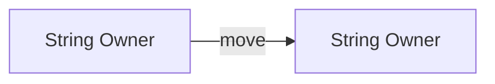
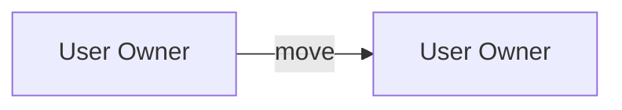
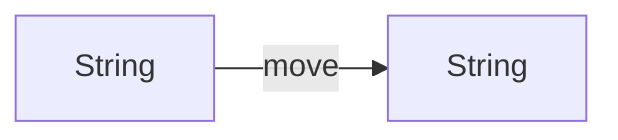

# **Topic 1.2.2: Ownership**

Ownership is Rust's core strategy for managing memory and resources through a strict set of rules enforced at compile time. Rather than relying on garbage collection or manual allocation and deallocation, Rust uses ownership semantics to define exactly who is responsible for a value at any point in time. This model guarantees memory safety, prevents entire classes of bugs, and enables deterministic resource cleanup without runtime overhead.

Ownership is not limited to memory; it applies uniformly to all resources, including heap allocations, file handles, sockets, and locks. Understanding ownership is essential for reasoning about program behavior, performance, and correctness in Rust.

## **Learning Objectives**

- Understand ownership as a compile-time memory and resource management strategy
- Apply Rust's ownership rules to real code examples
- Identify the classes of bugs ownership prevents
- Reason about ownership movement through assignments and function boundaries
- Distinguish stack-only values from heap-backed values under ownership semantics
- Understand the relationship between ownership, scope, and the RAII pattern

---

## **Ownership Rules**

Rust enforces the following three rules:

1. Each value in Rust has a variable that is its **owner**.
2. There can only be **one owner at a time**.
3. When the owner goes out of scope, the value is **dropped**.

These rules are absolute and are checked entirely at compile time. The compiler uses a borrow checker to verify that these invariants hold throughout program execution. Any violation results in a compile-time error, making ownership violations impossible at runtime.

---

## **Problems Ownership Solves**

Ownership eliminates several critical categories of memory errors:

- **Memory leaks**
  Resources are always released when their owner goes out of scope. This implements the Resource Acquisition Is Initialization (RAII) pattern automatically.
- **Double free**
  A value cannot be dropped more than once because it cannot have multiple owners. The move semantics ensure that only one binding can reference heap data at any time.
- **Use-after-free**
  Once ownership ends, the value is no longer accessible. The compiler prevents any attempt to use freed memory.

These guarantees hold even in the presence of early returns or panics, as Rust's drop semantics are enforced regardless of control flow.

---

## **Ownership in Action**

### Stack-Allocated Primitives

Primitive types (e.g., integers, booleans, floats) are stored entirely on the stack and implement the `Copy` trait. `Copy` is a marker trait indicating that the type can be safely duplicated by bitwise copying.

```rust
fn main() {
    let x = 5;
    let y = x; // x is copied, not moved

    println!("{x}, {y}");
}
```

- `x` remains valid after assignment.
- Both variables own independent copies of the value.
- Copy is implicit and zero-cost because the data already exists on the stack.

**Note:** Only types whose semantics don't require special cleanup can implement `Copy`. A type cannot implement both `Copy` and `Drop`.

### Heap-Allocated Data via Structs

Types that manage heap memory (such as `String` or structs containing them) do **not** implement `Copy`. When you assign or pass such a value, ownership is **moved** rather than copied.

```rust
fn main() {
    let s1 = String::from("hello");
    let s2 = s1; // ownership is moved

    // println!("{s1}"); // compile-time error
    println!("{s2}");
}
```

Here, ownership of the heap allocation moves from `s1` to `s2`. After the move, `s1` is considered uninitialized and cannot be used.



**Memory Layout:** The stack contains a pointer, capacity, and length. Only the binding (`s1` or `s2`) changes; the heap data remains at the same location.

---

## **Mutable vs. Immutable Ownership**

Ownership is independent of mutability.

```rust
let s = String::from("data");      // immutable owner
let mut t = String::from("data");  // mutable owner
```

- Mutability controls *whether the owner may modify the value*.
- Ownership controls *who is responsible for the value*.
- Rust enforces both independently.

An immutable binding can still transfer ownership to another immutable binding. Mutability is a property of the binding, not the value itself.

---

## **Moving Ownership**

### Copy vs. Move Semantics

- **Primitives** are copied by default.
- **Heap-backed types** are moved by default.

```rust
#[derive(Debug)]
struct User {
    name: String,
}

fn main() {
    let user1 = User {
        name: String::from("Alice"),
    };

    let user2 = user1; // move occurs

    // println!("{:?}", user1); // compile-time error
    println!("{:?}", user2);
}
```



When `user1` is assigned to `user2`, the entire struct is moved. The `String` inside is moved, invalidating `user1`.

### Cloning to Avoid a Move

Explicit cloning creates a deep copy of the data, including any heap allocations.

```rust
let user1 = User {
    name: String::from("Alice"),
};

let user2 = user1.clone();

println!("{:?}", user1);
println!("{:?}", user2);
```

- Cloning is explicit and potentially expensive.
- Rust requires intent to avoid accidental performance costs.
- The `.clone()` method is available on types that implement the `Clone` trait.

---

## **Moving Ownership Into Functions**

By default, function parameters take ownership of their arguments.

```rust
fn consume(s: String) {
    println!("{s}");
}

fn main() {
    let msg = String::from("hello");
    consume(msg);

    // println!("{msg}"); // compile-time error
}
```

- Ownership transfers into the function.
- When the function ends, the value is dropped.
- The function is responsible for cleanup.

Primitives still use copy semantics:

```rust
fn print_num(n: i32) {
    println!("{n}");
}

fn main() {
    let x = 10;
    print_num(x);

    println!("{x}"); // valid
}
```



**Design Pattern:** Functions that consume ownership typically do so for types representing resources that must be managed. Consider using references (borrowing) to avoid unnecessary ownership transfers.

---

## **Moving Ownership Out of Functions**

Ownership can be transferred back via return values.

```rust
fn create_message() -> String {
    String::from("hello")
}

fn main() {
    let msg = create_message();
    println!("{msg}");
}
```


- Ownership flows predictably through return types.
- This enables safe factory-style APIs without garbage collection.
- The caller becomes the new owner and is responsible for cleanup.

Functions can also return ownership of multiple values using tuples or structs, enabling flexible API design.

---

## **Professional Applications and Implementation**

Ownership defines how Rust programs are structured in production environments. It enables:

- **Predictable memory usage** without runtime overhead
- **Zero-cost abstractions** that compile down to efficient machine code
- **Strong safety guarantees** in systems where failures are unacceptable
- **Explicit resource ownership** making code intent clear

Backend services, operating systems, embedded firmware, and security tools all rely on ownership semantics to manage resources correctly under load and failure conditions. The ownership system also serves as a contract between code modules, making API boundaries explicit and preventing misuse.

Clear ownership boundaries improve API design, making it explicit who is responsible for cleanup and preventing accidental resource leaks or use-after-free bugs.

---

## **Key Takeaways**

| Concept        | Summary                                                       |
| -------------- | ------------------------------------------------------------- |
| Ownership      | A compile-time system that assigns responsibility for values. |
| Rules          | Single owner, scoped lifetime, automatic drop.                |
| Safety         | Prevents leaks, double frees, and use-after-free errors.      |
| Move Semantics | Ownership transfers instead of implicit copying.              |
| Copy Semantics | Primitives are implicitly copied; custom types opt-in.        |
| Functions      | Ownership flows through parameters and return values.         |
| RAII           | Rust automatically implements RAII for all owned values.      |

- Ownership is the foundation of Rust's memory safety guarantees
- Copy and move semantics are determined by type, not syntax
- Explicit cloning makes performance costs visible
- Ownership flow is enforced at compile time, eliminating runtime errors
- Mastery of ownership is required to understand borrowing and lifetimes
- Ownership enables deterministic resource cleanup without garbage collection

