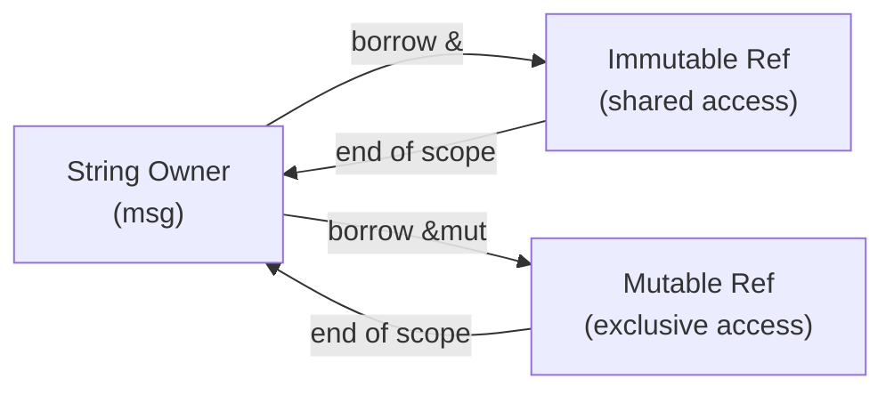

# **Topic 1.2.3: Borrowing**

Borrowing is the act of creating references to values without taking ownership. References are pointer-like constructs with strict compile-time rules that ensure memory safety and prevent data races. Borrowing allows code to access data efficiently while preserving clear ownership boundaries, enabling safe sharing and mutation without garbage collection or runtime checks.

Borrowing is central to Rust's performance model: it enables zero-copy access to data while ensuring that references are always valid for the duration of their use.

## **Learning Objectives**

- Understand borrowing as a reference-based access mechanism
- Distinguish borrowing from ownership transfer
- Apply borrowing rules to mutable and immutable references
- Prevent data races and dangling references at compile time
- Pass values by reference across function boundaries safely
- Understand reference lifetimes and scope interactions
- Recognize common borrowing patterns and anti-patterns

---

## **Why Borrow?**

- **Performance**
  - Avoids unnecessary heap allocations and copies
  - Enables zero-cost access to data
  - Reduces memory fragmentation
- **Ownership Not Required**
  - Many operations only need temporary access
  - Ownership remains with the original variable
- **API Clarity**
  - Function signatures explicitly show read vs. mutate intent
  - Callers understand whether data is consumed

---

## **Borrowing Rules**

Rust enforces the following rules at compile time:

- At any given time, you may have:
  - **One mutable reference**, or
  - **Any number of immutable references**
- **References must always be valid**
  - A reference cannot outlive the value it points to
- **Borrowing must be non-overlapping**
  - Once a mutable reference is created, neither the owner nor other references may be accessed until the mutable reference goes out of scope

These rules are fundamental to Rust's guarantees and are checked entirely at compile time with zero runtime overhead.

### Problems Borrowing Solves

- **Data races**
  - Prevents simultaneous mutable access from multiple sources
  - Ensures thread-safe access patterns without locks when possible
- **Dangling references**
  - Ensures references never outlive their owners
  - Compiler prevents returning references to local variables
- **Use-after-free bugs**
  - Invalidity checks prevent accessing freed memory

---

## **Immutable References**

Immutable references provide read-only access to data.

- Created using `&`
- Do not allow modification through the reference
- Multiple immutable references are allowed simultaneously
- Validity is checked against the owner's lifetime
- Can coexist with the owner's immutable access

```rust
fn main() {
    let s = String::from("hello");

    let r1 = &s;
    let r2 = &s;
    let r3 = &s;

    println!("{r1} and {r2} and {r3}");
    // s is still accessible here
}
```

- Ownership remains with `s`
- `r1`, `r2`, `r3` are read-only views
- All references are dropped at the end of their scope

---

## **Mutable References**

Mutable references allow controlled modification of data.

- Created using `&mut`
- Only one mutable reference is allowed at a time
- No immutable references may coexist with a mutable reference
- Enforced entirely at compile time with no runtime cost
- The borrower has exclusive access for the duration of the borrow

```rust
fn main() {
    let mut s = String::from("hello");

    let r = &mut s;
    r.push_str(" world");

    println!("{r}"); // "hello world"
    // r goes out of scope here; s is accessible again
}
```

Attempting multiple mutable references or mixing mutable and immutable references results in a compile-time error. This exclusivity ensures that mutations are visible and predictable.

```rust
// This will not compile:
let mut x = 5;
let r1 = &mut x;
let r2 = &mut x; // Error: cannot borrow x as mutable more than once
```

---

## **Passing by Reference**

Borrowing is commonly used when passing values to functions, allowing functions to read or modify data without claiming ownership.

```rust
fn print_length(s: &String) {
    println!("{}", s.len());
}

fn main() {
    let msg = String::from("hello");

    print_length(&msg);

    println!("{msg}"); // ownership is retained
}
```

- The function borrows the value
- Ownership remains with the caller
- The borrowed reference is dropped when the function returns
- The caller can continue using `msg`

**Mutable Borrowing in Functions:**

```rust
fn append_exclamation(s: &mut String) {
    s.push('!');
}

fn main() {
    let mut msg = String::from("hello");
    
    append_exclamation(&mut msg);
    
    println!("{msg}"); // "hello!"
}
```



---

## **Borrowing and Scope Interaction**

Reference scope ends at the last point of use, not necessarily at the end of the block:

```rust
fn main() {
    let mut x = 5;
    
    let r1 = &x;
    let r2 = &x;
    println!("{r1} {r2}"); // Last use of r1, r2
    
    let r3 = &mut x; // Valid! r1, r2 are no longer used
    *r3 += 1;
    println!("{r3}");
}
```

This "Non-Lexical Lifetimes" (NLL) feature makes Rust code more flexible while maintaining safety guarantees.

---

## **Professional Applications and Implementation**

Borrowing enables high-performance APIs by allowing functions and modules to operate on shared data without copying or transferring ownership. This pattern is critical in systems programming, backend services, and data processing pipelines, where efficiency and correctness must coexist.

Rust's borrowing rules eliminate data races in single-threaded and multi-threaded contexts, making concurrent code safer by construction. Borrowing also encourages clearer API contracts by explicitly distinguishing between read-only and mutable access.

In practice, borrowing appears in:

- **Collection APIs**: Iterators borrow elements without consuming the collection
- **Builder patterns**: Methods return `&mut self` for chaining while maintaining type safety
- **Callback registration**: Callbacks can borrow data without claiming ownership
- **Parser combinators**: Efficient parsing without intermediate allocations

---

## **Key Takeaways**

| Concept               | Summary                                              |
| -------------------   | ---------------------------------------------------- |
| Borrowing             | Temporary access to data without ownership transfer. |
| References            | Pointer-like types with strict compile-time rules.   |
| Immutable Borrowing   | Allows many read-only references simultaneously.     |
| Mutable Borrowing     | Allows exclusive, updatable access to data.          |
| Safety                | Prevents data races and dangling references.         |
| Non-Lexical Lifetimes | References drop at last use, not block end.          |

- Borrowing enables zero-copy, high-performance data access
- Ownership remains unchanged during borrowing
- Compile-time enforcement guarantees reference validity
- Clear borrowing rules form the basis for safe concurrency
- Mutable and immutable references are mutually exclusive
- Mastery of borrowing is essential before learning lifetimes and async Rust
