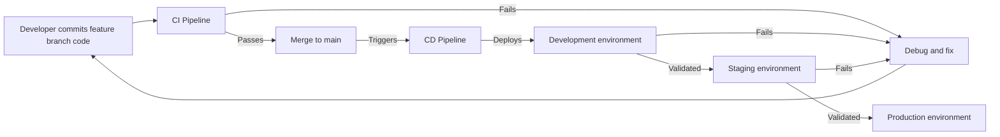

# **Topic 4.1.6: CI/CD with GitHub Actions**

Continuous Integration and Continuous Deployment are practices that automate the pipeline from code commit to running service. But more importantly, they are about feedback, telling developers when something is broken while the context is fresh and the fix is cheap. GitHub Actions is an automation platform tightly integrated with GitHub repositories. It excels at running workflows triggered by events like commits, pull requests, and tags, which makes it well-suited for managing build, test, and deployment pipelines for Rust microservices.

The power of CI/CD is not just the automation itself. It is the ability to enforce consistency, detect issues early, and enable rapid iteration with confidence.

## **Learning Objectives**

- Explain why CI/CD matters for microservices and why feedback speed is critical
- Design and implement CI pipelines that catch problems before they reach main
- Build CD pipelines that promote code safely from development through production
- Use GitHub Actions to define reproducible, event-driven workflows
- Optimize Rust workflows for fast feedback and minimal friction
- Manage secrets, configuration, and multi-environment deployments safely
- Apply testing strategies that work at CI scale
- Evaluate when GitHub Actions is the right tool and when alternatives fit better 

---


## **The Problem CI/CD Solves**

In a microservices system, code changes must flow through multiple stages to reach production. Without automation, that flow is manual, error-prone, and slow.

### Without CI/CD

- Developers commit code and hope it works
- Manual testing is tedious and often incomplete
- Deployment requires coordination and careful preparation
- Bugs found in production are expensive to fix
- Rollback is risky and time-consuming
- Feedback loops are slow (hours or days)

### With CI/CD

- Every commit is immediately tested
- Failures are caught within minutes
- Deployment is repeatable and reliable
- Code changes flow from development to production automatically
- Rollback happens safely when needed
- Feedback is instant (measured in seconds to minutes)

For Rust microservices, CI/CD is especially valuable because compile-time guarantees catch many issues, but they only work if the code actually compiles. Automation ensures that compiles happen immediately and consistently.

---

## **GitHub Actions: The Automation Platform**

GitHub Actions is an event-driven workflow system integrated directly into GitHub repositories. A workflow is a YAML file that describes what to do when certain events happen.

### Core Concepts

- **Workflow**: A YAML file defining the entire automation process
- **Event**: Something that triggers a workflow (push, pull request, tag, schedule, manual dispatch)
- **Job**: A unit of work that runs on a runner
- **Step**: A single action or shell command within a job
- **Runner**: The machine that executes the workflow

### How It Works

```text
Event (e.g., git push)
    ↓
Workflow is triggered
    ↓
Jobs and steps run on a runner
    ↓
Artifacts are produced (logs, images, test reports)
    ↓
Result is reported back to GitHub (commit status, PR comment)
```

### Repository Structure

Workflows live in `.github/workflows/` at the root of the repository:

```text
my-repo/
  .github/
    workflows/
      ci.yml          # Runs on every push and PR
      release.yml     # Runs on tags
      deploy.yml      # Runs after release
```

---

## **Continuous Integration (CI)**

Continuous Integration is about **automating the process of validating that code works**.

### Core Idea

Every time code is committed or a pull request is opened, the CI pipeline runs. If the pipeline fails, the code is not merged. This creates a hard gate that protects the main branch from broken code.

### Key Validations in a Rust CI Pipeline

- **Compilation**
  - `cargo build` with full warnings enabled
  - Catches syntax errors, type errors, borrow checker violations

- **Unit and Integration Tests**
  - `cargo test` runs all tests in the crate
  - Some tests are fast; others may take longer
  - Parameterized tests help catch edge cases

- **Linting and Code Quality**
  - `cargo clippy` detects common mistakes and inefficiencies
  - `cargo fmt` enforces consistent formatting
  - Custom lints can enforce project-specific rules

- **Dependency Checking**
  - Scans for known vulnerabilities in dependencies
  - Tools: `cargo audit`, `cargo deny`

- **Documentation**
  - Ensure code examples in docs are correct (`cargo test --doc`)
  - Catch broken links and missing documentation

### Why Rust Makes CI Easier

- Compile-time checks catch many bugs before tests even run
- The type system enforces invariants that would need runtime checks in other languages
- Cargo ensures deterministic builds via `Cargo.lock`
- Single binary output simplifies containerization

### A Rust CI Workflow Basics

```bash
# Compile in release mode to catch all warnings
cargo build --release

# Run all tests (unit, integration, doc tests)
cargo test --release

# Check formatting compliance
cargo fmt -- --check

# Run linter with full warnings
cargo clippy --release -- -D warnings

# Check for security issues in dependencies
cargo audit
```

### Benefits of CI

- Broken code never makes it to main
- Developers get feedback while context is fresh
- Regressions are caught before they reach production
- Code quality standards are enforced consistently

### Basic GitHub Actions CI Workflow

```yaml
name: Rust CI

on:
  push:
    branches: [ main ]
  pull_request:

jobs:
  check:
    runs-on: ubuntu-latest
    steps:
      - uses: actions/checkout@v4
      
      - uses: dtolnay/rust-toolchain@stable
      
      - uses: Swatinem/rust-cache@v2
      
      - name: Compile
        run: cargo build --release
      
      - name: Run tests
        run: cargo test --release
      
      - name: Check formatting
        run: cargo fmt -- --check
      
      - name: Lint
        run: cargo clippy --release -- -D warnings
      
      - name: Audit dependencies
        run: cargo audit
```

### Why Each Step Matters

- **Checkout**: Get the code from the repository
- **Toolchain**: Install the Rust compiler and tools
- **Cache**: Save compilation artifacts so subsequent runs are faster
- **Compile**: Build in release mode to enable all optimizations and warnings
- **Tests**: Run all tests to catch regressions
- **Formatting**: Enforce consistent code style
- **Linting**: Catch common mistakes via clippy
- **Audit**: Detect known security vulnerabilities in dependencies

### Optimizing for Speed: Caching

The first build takes a long time because Rust must compile all dependencies. Subsequent builds are much faster if dependencies are cached.

```yaml
jobs:
  check:
    runs-on: ubuntu-latest
    steps:

      ...

      - uses: Swatinem/rust-cache@v2
        with:
          # Cache is tied to Cargo.lock, so it's invalidated only when deps change
          cache-targets: true
```

This can reduce build time from 5-10 minutes to 1-2 minutes on repeat runs.

### Testing Matrix: Multiple Rust Versions

You may want to test against multiple Rust versions:

```yaml
jobs:
  check:
    runs-on: ubuntu-latest
    strategy:
      matrix:
        rust: [ stable, beta, nightly ]
    steps:
      - uses: actions/checkout@v4
      - uses: dtolnay/rust-toolchain@master
        with:
          toolchain: ${{ matrix.rust }}

      ...
```

This runs the same tests three times—once for each Rust version. If nightly breaks something, you know about it before it becomes a problem.

### Conditional Steps

Sometimes you only want to run a step under certain conditions:

```yaml
- name: Generate coverage
  run: cargo tarpaulin --out Html
  if: matrix.rust == 'stable' # Only runs the step if condition is true

- name: Upload coverage report
  uses: codecov/codecov-action@v3
  if: matrix.rust == 'stable'
```

This runs coverage only once (with stable) instead of three times.

---

## **Continuous Deployment (CD)**

Continuous Deployment automates the **process of releasing validated code to production**.

### Core Idea

Once CI passes, the same code that was tested should be packaged and deployed to production automatically (or with minimal human gates). This removes the "we tested it in dev but production is different" problem.

### Environments in a Typical CD Pipeline

- **Development**
  - Where active development happens
  - Runs on every commit to feature branches
  - Can be chaotic; failures are expected

- **Staging**
  - Production-like environment for final validation
  - Runs on pull request merges or tags
  - Uses production database backups when possible
  - Final place to catch environment-specific issues

- **Production**
  - The live system serving real users
  - Deployed only on successful staging validation
  - Runs with monitoring, alerts, and rollback capability
  - Usually guarded by additional gates (manually triggered or time-gated)

### The Deployment Pipeline

Code flows through environments:



Each step is gated by automation.

### What Gets Deployed

- Source Code to PaaS platforms (e.g., Vercel, Heroku, AWS Elastic Beanstalk)
- Application binaries to SaaS platforms (e.g., AWS Lambda, Azure Functions)
- Container images to registries (ECR, Docker Hub, GCR)
- Kubernetes manifests to clusters
- Infrastructure-as-code to cloud platforms

### Risk Mitigation in Deployment

When deploying to production, the goal is to catch issues while minimizing impact:

- **Blue-Green Deployment**
  - Run two identical production environments (blue and green)
  - Route all traffic to blue
  - Deploy new version to green
  - Run smoke tests against green
  - Switch traffic to green
  - If issues occur, switch back to blue (instant rollback)

- **Canary Release**
  - Deploy new version to a small percentage of infrastructure
  - Monitor error rates, latency, and custom metrics
  - If healthy, gradually increase percentage (e.g., 5% → 25% → 100%)
  - If issues, automatically roll back the canary

- **Feature Flags**
  - Deploy code without turning on the feature
  - Control feature visibility at runtime
  - Enable for internal testing before rolling out to users
  - Can be toggled without redeployment

- **Graceful Shutdown and Health Checks**
  - Ensure services can shut down cleanly
  - Load balancer waits for in-flight requests to complete
  - Prevents request loss during rollouts

### A CD Example: From Code to Container Registry

This example assumes a Docker-based deployment where the CI pipeline builds a Rust binary, packages it into a Docker image, and pushes it to a registry. The CD pipeline then deploys that image to Kubernetes.

```yaml
name: Build and Publish # Define the workflow name
on: # Trigger for the CI/CD pipeline
  push:  # When code is pushed 
    tags: # Only run on tags (e.g., releases)
      - 'v*.*.*'
    # branches: [ main ] # Or run on pushes to main for non-release builds

jobs: # Define the tasks that run on the CI/CD pipeline
  deploy: # The name of you job
    runs-on: ubuntu-latest # Use the latest Ubuntu runner
    permissions: # Set permissions for the job
      contents: write

    steps: # Define the steps in the deployment process
      - uses: actions/checkout@v4 # Reference usable actions from GitHub Marketplace (this checks out the code)

      - uses: dtolnay/rust-toolchain@stable # Set up the Rust toolchain (stable version)

      - uses: Swatinem/rust-cache@v2 # Cache Rust dependencies to speed up subsequent builds

      - name: Build Rust binary # Name of the step
        run: cargo build --release # Run a command for the step (build the Rust binary in release mode)

      - name: Build Docker image
        run: |
          docker build \
            --tag ghcr.io/${{ github.repository }}:${{ github.ref_name }} \
            --tag ghcr.io/${{ github.repository }}:latest \
            .

      - name: Login to registry
        run: echo "${{ secrets.GITHUB_TOKEN }}" | docker login ghcr.io -u token --password-stdin

      - name: Push image
        run: docker push ghcr.io/${{ github.repository }}:${{ github.ref_name }}

      - name: Deploy to staging
        run: |
          kubectl set image deployment/rust-api \
            rust-api=ghcr.io/${{ github.repository }}:${{ github.ref_name }} \
            -n staging
```

The key is that the same binary that was tested in CI is what gets deployed—no rebuilding, no recompiling.

Notice:

- This only runs on tags (e.g., `v1.0.0`) [Can be run on branch pushes instead]
- The image is tagged with the version number so it is easy to find
- `latest` is also pushed for convenience

### Deploy to Kubernetes

```yaml
name: Deploy to Kubernetes

on:
  workflow_run: # Trigger this workflow after another workflow completes
    workflows: [ "Build and Publish" ] # Only run after the "Build and Publish" workflow
    types: [ completed ] # Only run when the workflow completes
    branches: [ main ] # Only run on the main branch

jobs:
  deploy:
    if: ${{ github.event.workflow_run.conclusion == 'success' }} # Only run if the previous workflow succeeded
    runs-on: ubuntu-latest
    
    steps:
      - uses: actions/checkout@v4
      
      - name: Configure kubectl
        run: |
          mkdir -p $HOME/.kube
          echo "${{ secrets.KUBE_CONFIG }}" | base64 -d > $HOME/.kube/config
          chmod 600 $HOME/.kube/config
      
      - name: Deploy to staging
        run: |
          kubectl set image deployment/rust-api \
            rust-api=ghcr.io/${{ github.repository }}:${{ github.sha }} \
            -n staging --record
      
      - name: Wait for rollout
        run: kubectl rollout status deployment/rust-api -n staging --timeout=5m
      
      - name: Run smoke tests
        run: |
          # Basic health check against staging
          curl -f https://staging-api.example.com/health || exit 1
```

Key points:

- This workflow runs after the build completes
- A secret contains the kubeconfig for cluster access
- The deployment uses the exact image SHA from the build
- A health check confirms the deployment succeeded

---

## **Managing Secrets and Configuration**

Secrets (API tokens, database passwords, private keys) must never be committed to the repository.

### GitHub Secrets

GitHub provides an encrypted secret store:

1. Go to repository settings → Secrets
2. Create a secret (e.g., `DOCKER_PASSWORD`)
3. Reference it in workflow: `${{ secrets.DOCKER_PASSWORD }}`

```yaml
- name: Login to Docker Hub
  run: |
    echo "${{ secrets.DOCKER_PASSWORD }}" | \
    docker login -u ${{ secrets.DOCKER_USER }} --password-stdin
```

### Best Practices

- Use least-privilege tokens (only needed permissions)
- Rotate tokens periodically
- Use separate tokens for different services
- Never log secrets (GitHub masks them, but be careful)
- Consider using OIDC for temporary credentials instead of long-lived tokens

### Configuration Without Hardcoding

For non-secret configuration, use environment variables or ConfigMaps:

```yaml
- name: Deploy
  env:
    DATABASE_POOL_SIZE: 10
    LOG_LEVEL: info
    FEATURE_FLAG_NEW_API: "false"
  run: |
    kubectl set env deployment/rust-api \
      DATABASE_POOL_SIZE=$DATABASE_POOL_SIZE \
      LOG_LEVEL=$LOG_LEVEL \
      -n production
```

For Kubernetes, this typically lives in ConfigMaps:

```yaml
apiVersion: v1
kind: ConfigMap
metadata:
  name: rust-api-config
data:
  LOG_LEVEL: info
  CACHE_TTL: "3600"
```

---

## **Testing at Scale**

CI is not just compiling and unit testing. It should cover the kinds of bugs that matter in production.

### Testing Levels

- **Unit Tests**: Test individual functions

  ```rust
  #[test]
  fn test_parse_user() {
      assert_eq!(parse("alice"), User { name: "alice" });
  }
  ```

- **Integration Tests**: Test combinations of components

  ```rust
  #[tokio::test]
  async fn test_user_service_with_db() {
      let db = setup_test_database().await;
      let service = UserService::new(db);
      let user = service.create("alice").await;
      assert_eq!(user.name, "alice");
  }
  ```

- **Property-Based Tests**: Test invariants across random inputs

  ```rust
  #[cfg(test)]
  mod tests {
      use proptest::proptest;
      
      proptest! {
          #[test]
          fn test_serialize_deserialize(s in ".*") {
              let json = serde_json::to_string(&s).unwrap();
              let deserialized: String = serde_json::from_str(&json).unwrap();
              prop_assert_eq!(s, deserialized);
          }
      }
  }
  ```

- **Benchmarks**: Track performance over time

  ```rust
  #[bench]
  fn parse_json(b: &mut Bencher) {
      let data = r#"{"name": "alice"}"#;
      b.iter(|| serde_json::from_str::<User>(data))
  }
  ```

In CI, run all of these together:

```yaml
- name: Run tests
  run: cargo test --all-targets --release
  
- name: Run doc tests
  run: cargo test --doc
  
- name: Run benches (for comparison)
  run: cargo bench --no-run
```

### Test Organization for Microservices

In a microservices monorepo, each service has its own tests:

```text
services/
  user-service/
    src/
    tests/
    Cargo.toml
  order-service/
    src/
    tests/
    Cargo.toml
```

Run all tests:

```yaml
- run: cargo test --workspace
```

Or run tests for only changed services:

```yaml
- name: Detect changes
  run: git diff HEAD~1 --name-only | head -1 | xargs dirname > changed_dir.txt

- name: Run tests for changed service
  run: cargo test -p $(cat changed_dir.txt)
```

---

## **Handling Deployment Failures**

Not every deployment succeeds, and that is okay. The pipeline should handle failure gracefully.

### Automatic Rollback

```yaml
- name: Deploy new version
  id: deploy
  run: kubectl set image deployment/rust-api rust-api=ghcr.io/...

- name: Wait for rollout
  run: kubectl rollout status deployment/rust-api --timeout=5m
  
- name: Rollback on failure
  if: failure()
  run: kubectl rollout undo deployment/rust-api
```

### Monitoring During Rollout

```yaml
- name: Check error rates during rollout
  run: |
    # Poll Prometheus or similar monitoring system
    ERROR_RATE=$(curl -s http://prometheus/query?rate=errors_5m | jq .)
    if (( $(echo "$ERROR_RATE > 0.05" | bc -l) )); then
      echo "Error rate too high, rolling back"
      kubectl rollout undo deployment/rust-api
      exit 1
    fi
```

### Post-Deployment Steps

```yaml
- name: Run smoke tests
  run: ./scripts/smoke-tests.sh https://api.example.com

- name: Notify on success
  if: success()
  run: |
    curl -X POST ${{ secrets.SLACK_WEBHOOK }} \
      -d '{"text": "Deployment to production succeeded"}'

- name: Notify on failure
  if: failure()
  run: |
    curl -X POST ${{ secrets.SLACK_WEBHOOK }} \
      -d '{"text": "Deployment to production FAILED - rolled back"}'
```

---

## **GitHub Actions Alternatives**

The market has many CI/CD platforms. Each has trade-offs.

### GitLab CI/CD

- Tightly integrated with GitLab repositories
- Strong visualization tools and pipeline control
- Self-hosted option available
- Good if you use GitLab for repository hosting

### CircleCI

- High-performance pipelines with advanced caching
- Good free tier for open source
- Strong orb ecosystem (reusable workflow components)
- Excellent if you need speed and do not want to self-host

### Jenkins

- Highly customizable and scriptable
- Plugins for almost anything
- Self-hosted (you manage infrastructure)
- Good if you need advanced customization and have ops resources
- Requires significant maintenance effort

### Azure DevOps Pipelines

- Tightly integrated with Azure and Microsoft ecosystem
- Good if you use Azure cloud services
- Strong integration with Visual Studio and Azure DevOps boards

### Buildkite

- Lightweight, fast platform
- Agents can run on your hardware
- Good for teams that want flexibility
- Requires more setup than GitHub Actions

### Choosing Between Them

- **GitHub Actions**: Best if code is on GitHub, want simple integration
- **GitLab CI**: Best if using GitLab, need self-hosted option
- **CircleCI**: Best if performance and caching are critical
- **Jenkins**: Best if you need maximum customization and have ops team
- **Azure Pipelines**: Best if using Azure cloud and Microsoft ecosystem

---

## **Practical Patterns for Rust Microservices**

### Monorepo Workflow

If you have multiple Rust services in one repo:

```yaml
name: Multi-service CI

on: [ push, pull_request ]

jobs:
  test:
    strategy:
      matrix:
        service: [ user-service, order-service, payment-service ]
    
    runs-on: ubuntu-latest
    steps:
      - uses: actions/checkout@v4
      - uses: dtolnay/rust-toolchain@stable
      - uses: Swatinem/rust-cache@v2
      
      - run: cargo test -p ${{ matrix.service }}
```

This runs tests for each service in parallel.

### Cross-Compilation

If you need to support multiple architectures:

```yaml
- uses: dtolnay/rust-toolchain@stable
  with:
    targets: x86_64-unknown-linux-gnu,aarch64-unknown-linux-gnu

- name: Build for x86_64
  run: cargo build --release --target x86_64-unknown-linux-gnu

- name: Build for ARM64
  run: cargo build --release --target aarch64-unknown-linux-gnu
```

### Security Scanning in CI

```yaml
- name: SBOM generation
  run: cargo sbom > sbom.json

- name: Dependency audit
  run: cargo audit --json > audit.json

- name: Container scanning
  uses: aquasecurity/trivy-action@master
  with:
    image-ref: ghcr.io/${{ github.repository }}:latest
    format: json
    output: trivy-results.json
```

---

## **Professional Applications and Implementation**

CI/CD pipelines are critical in production environments:

- Automating testing and validation of code changes
- Ensuring consistent deployment across environments
- Reducing time-to-market for new features
- Enabling DevOps and GitOps workflows
- Supporting scalable microservices delivery pipelines

For Rust-based systems:

- Ensures safe, performant code is continuously validated
- Integrates seamlessly with containerization and orchestration workflows
- Reduces operational risk in high-performance distributed systems

---

## **Key Takeaways**

| Concept Area | Summary |
| --- | --- |
| CI | Automatically validates every commit with tests and linting. |
| CD | Automatically deployments validated code to production. |
| GitHub Actions | Event-driven workflows defined in YAML; tightly integr with GitHub. |
| Caching | Rust-cache saves compilation artifacts; reduces build time 70-80%. |
| Secrets | Use GitHub Secrets, environment variables, and least privilege tokens. |
| Testing | Unit, integration, property-based, and benchmark tests at CI scale. |
| Deployment | Use blue-green, canary, or feature flags to minimize risk. |
| Monitoring | Automatic rollback when error rates spike during rollout. |

- CI/CD is not just automation; it is a feedback loop that enables confidence
- Fast feedback (seconds to minutes) matters more than perfect automation
- Rust compiles are slow, but caching and parallelism make them manageable
- Secrets and configuration must be separated from code
- Deployment risk decreases when you have monitoring and automatic rollback
- Choose platforms based on integration and team familiarity, not just feature richness
